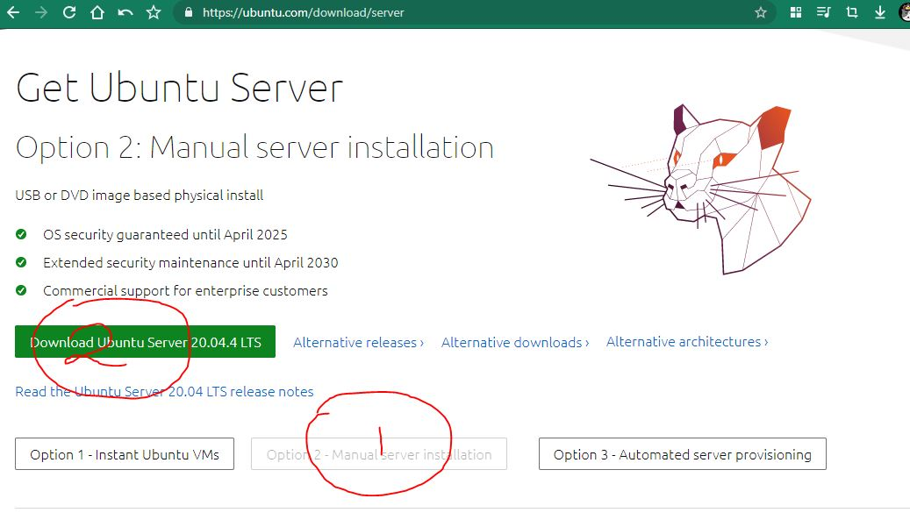
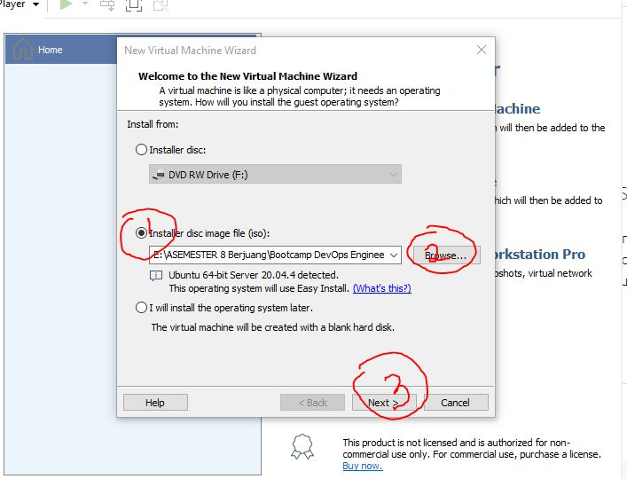

# Task 1 Day 1

# Step 1

## Download Ubuntu Server dan VMware terlebih dahulu

1. Link untuk mendownload https://ubuntu.com/download/server lalu klik "option 2 - Manual server installation"

2. Download VMware terlebih dahulu https://www.vmware.com/products/workstation-player/workstation-player-evaluation.html seperti gambar dibawah ini

Kiri untuk Windows dan kanan untuk Linux

# Step 2

## Instalation and Configuration VMware

1. Setelah download aplikasi maka langsung di install lalu jalankan VMware klik "Create a New Virtual Machine" 

2. Kemudian pilih "Installer disc image (iso)" agar memasukkan file iso Ubuntu server lalu browse dan pilih file Ubuntu Server yang telah di download sebelumnya

3. Selanjutnya Input nama kita dan password nya.

