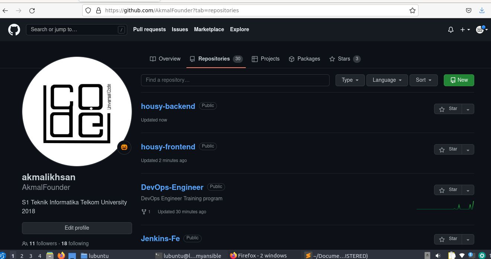
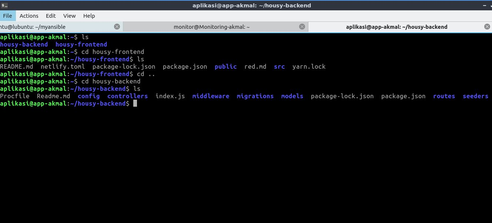
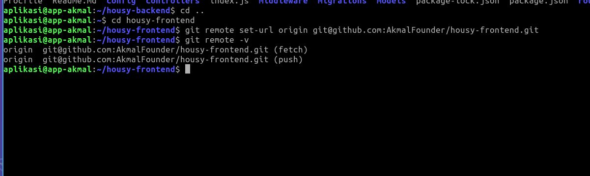
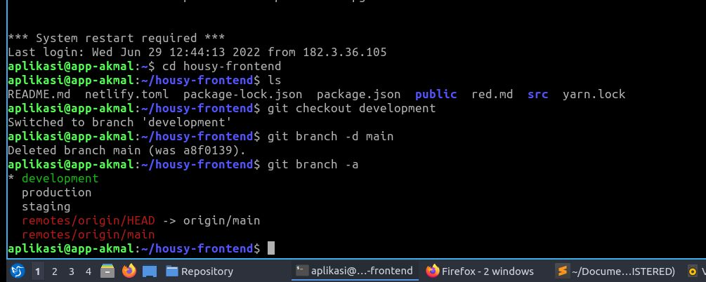
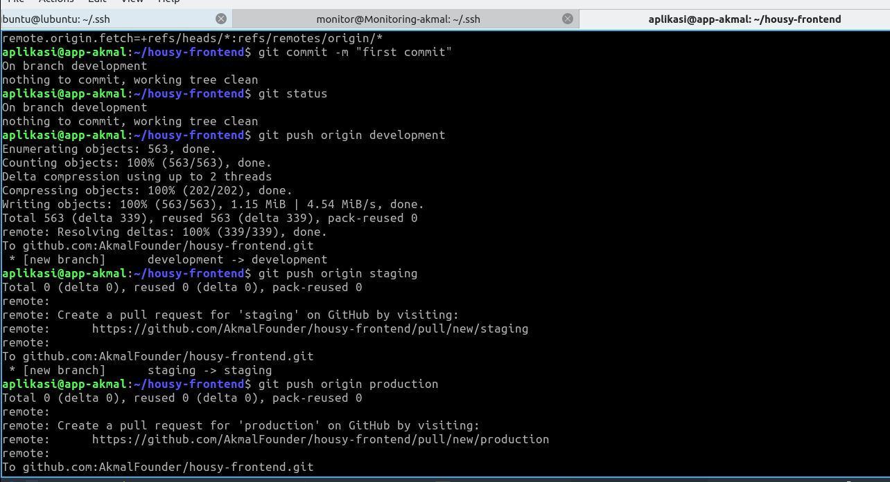
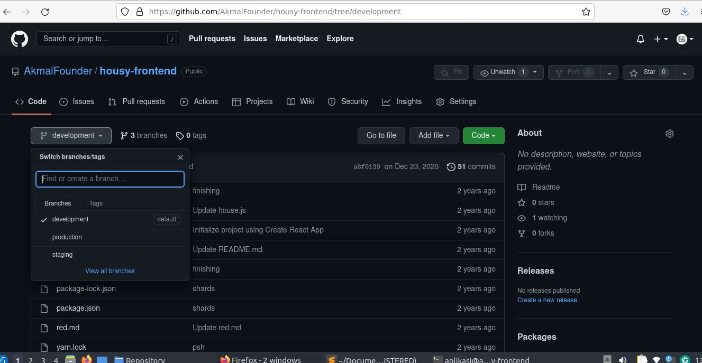
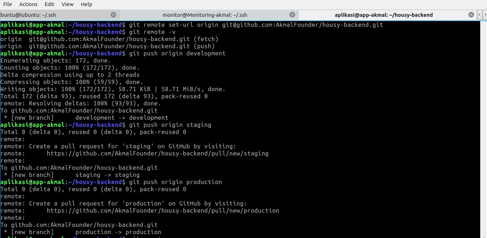
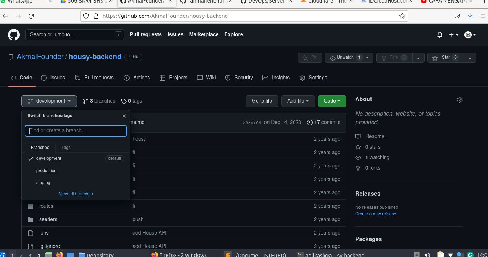

# MEMBUAT REPOSITORY

## REPOSITORY

- Repositori Git melacak dan menyimpan riwayat semua perubahan yang dibuat pada file dalam proyek Git. Ini menyimpan data ini dalam direktori bernama .git, juga dikenal sebagai folder repositori.

Git menggunakan sistem kontrol versi untuk melacak semua perubahan yang dibuat pada proyek dan menyimpannya di repositori. Pengguna kemudian dapat menghapus atau menyalin repositori yang ada atau membuat yang baru untuk proyek yang sedang berlangsung.

ref:https://phoenixnap.com/kb/what-is-a-git-repository 

## LANGKAH AWAL

Pertama-tama saya akan membuat sebuah repository pada github 

Kemudian Cloning kedua aplikasi

FE : https://github.com/dumbwaysdev/housy-frontend

BE : https://github.com/dumbwaysdev/housy-backend

Kemudian ganti remote sesuai repository dan push ke github

Kemudian membuat 3 branch : development, staging, production 

FE :

Kemudian push ke masing masing branch ke github

FE :

BE :

