# SSH


Secure shell atau SSH adalah protokol transfer yang memungkinkan penggunanya untuk mengontrol sebuah perangkat secara remote atau dari jarak jauh melalui koneksi internet yang pastinya aman. Atau bahasa mudahnya adalah sebagai kunci untuk mengakses perangkat

Pada [case sebelumnya](https://github.com/pinoezz/DevOps/blob/main/Stage-2/Day-1/Cloud-Computing-with-IDCH-(IdCloudhost).md) saya sudah membuat suatu aplikasi frontend yang sudah dapat di akses menggunakan domain https://alfino.studentdumbways.my.id/login dan sudah tersertifikasi SSL


# Membuat server backend dan database menggunakan [IdCloudhost](https://console.idcloudhost.com/) 

# Membuat server backend


- Lakukan registrasi atau login 

Kemudian pilih compute dan NEW 

- Saya akan menggunakan ubuntu versi 20.04 LTS Server Indonesia

Kemudian isi username password dan resource name lalu create

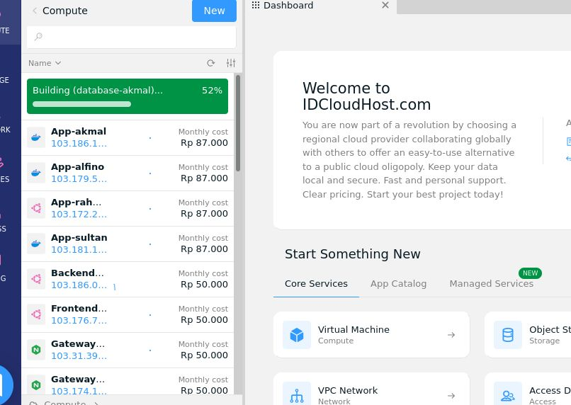

Tunggu hingga proses selesai


Apabila sudah selesai saya akan login pada terminal saya


# Membuat server database

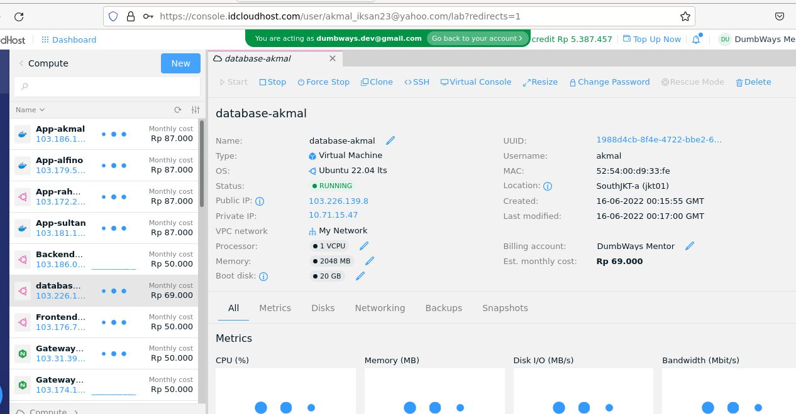

Untuk server database juga saya menggunakan ubuntu versi 20.04 LTS


# Generate SSH Key dan transfer ke semua server

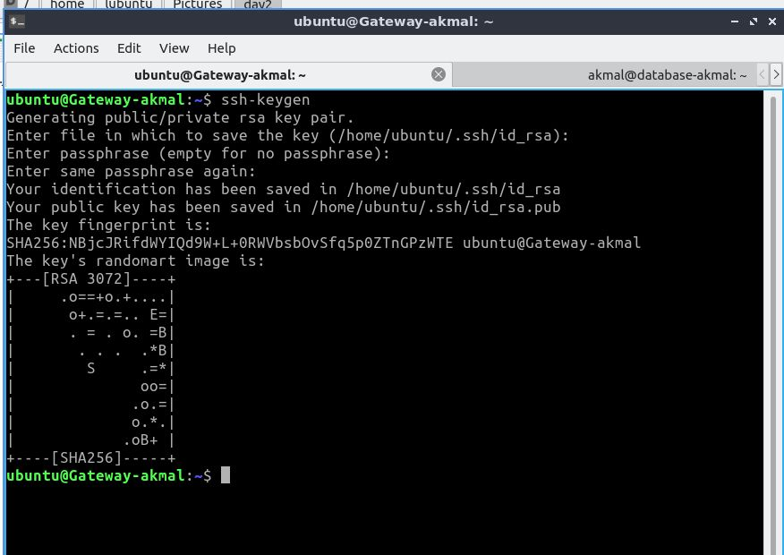

Pertama tama gunakan ssh-keygen untuk membuat ssh key

```
ssh-keygen
```

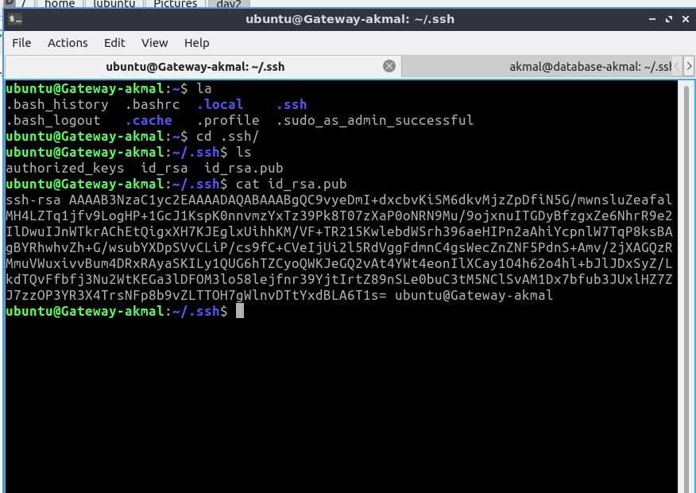

Kemudian masuk ke direktori .ssh lalu gunakan perintahcat untuk melihat id_rsa.pub

```
cat id_rsa.pub
```

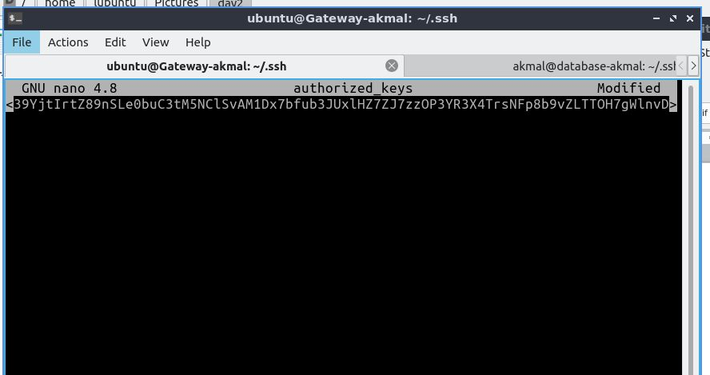

Kemudian buat file authorized_keys dan masukan id_rsa.pub kalian disini lalu save dan exit


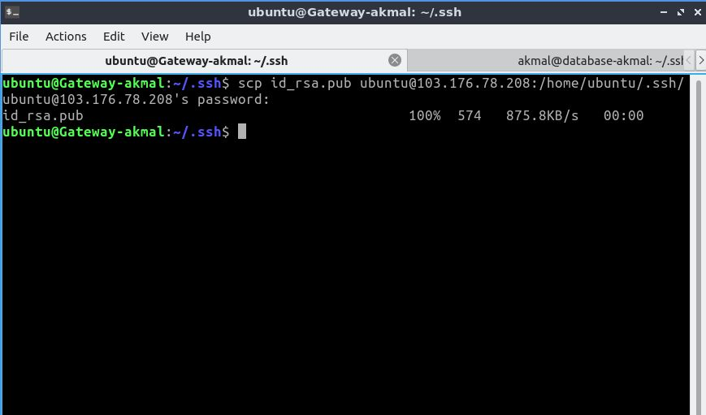


Kemudian saya akan memigrasikan file ssh id_rsa.pub ke server aplikasi frontend menggunakan perintah scp id_rsa.pub "username"@ip:./


Pada server gateway masukan perintah

```
scp id_rsa.pub aplikasi@103.31.38.84:/home/aplikasi/.ssh/
```


id_rsa.pub berhasil di migrasi kemudian buat authorized_keys

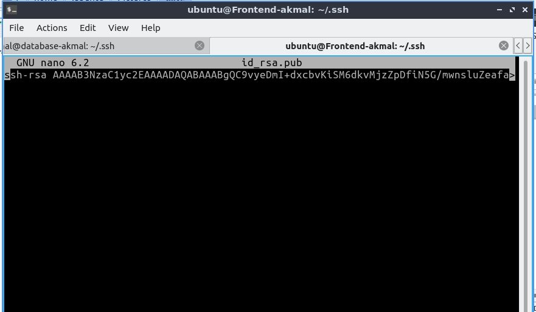

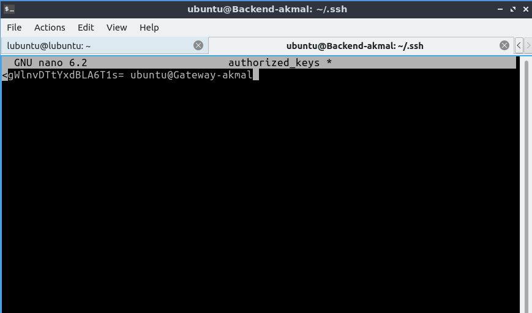

Masukan id_rsa.pub

Kemudian kita coba login server Backend tanpa password pada server gateway 

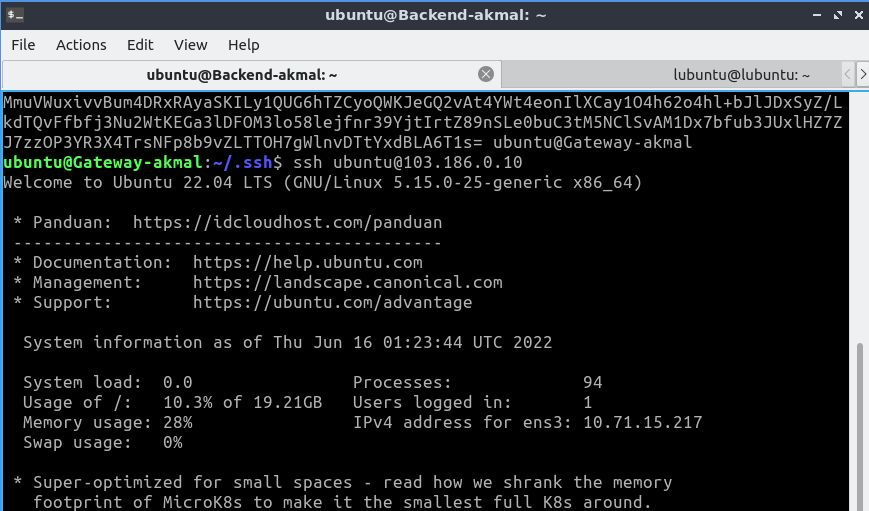

Berhasil ya

Kemudian lakukan hal serupa pada ke 3 server lainnya.....


# MySQL 


MySQL adalah sebuah database management system (manajemen basis data) menggunakan perintah dasar SQL (Structured Query Language) yang cukup terkenal. Database management system (DBMS) MySQL multi pengguna dan multi alur ini sudah dipakai lebih dari 6 juta pengguna di seluruh dunia.


# Membuat server Database menggunakan [IdCloudhost](https://console.idcloudhost.com/) 


# Membuat user baru untuk database

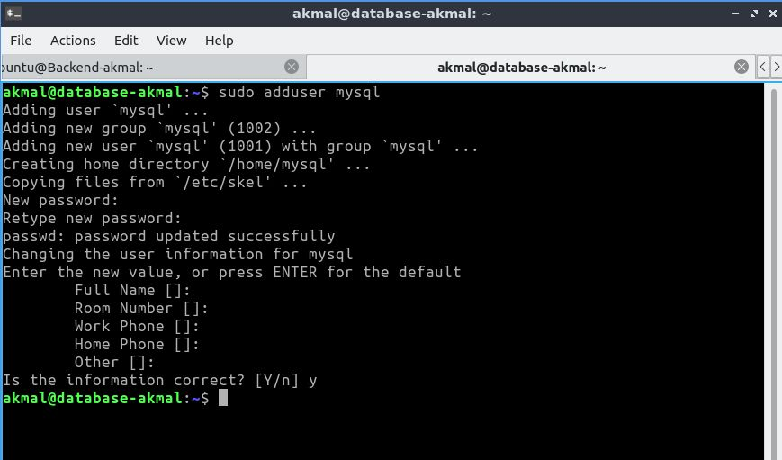


Menggunakan perintah adduser untuk menambahkan user

```
sudo adduser mysql
```

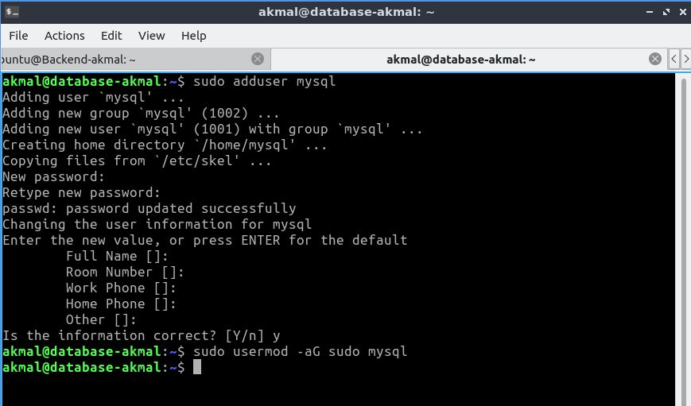


Untuk memberikan izin sudo pada user baru gunakan perintah

```
sudo usermod -aG sudo mysql
```


# Menginstall mysql pada server Database


```
sudo apt update ; sudo apt upgrade
```
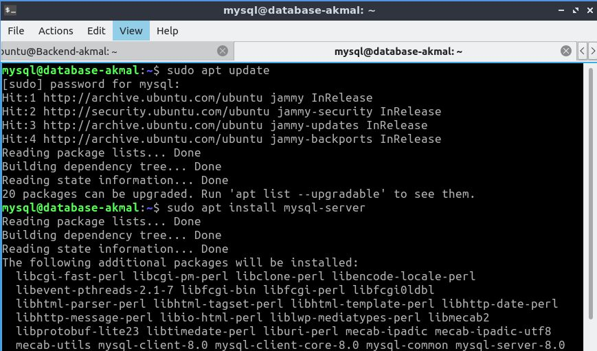

```
sudo apt install mysql-server
```


Untuk instalasi baru MySQL, Anda akan menjalankan skrip keamanan DBMS yang disertakan. Skrip ini mengubah beberapa opsi asali yang kurang aman untuk hal-hal seperti log masuk root jarak jauh dan pengguna sampel.


Untuk instalasi mysql gunakan perintah

```
sudo apt get install mysql-server
```

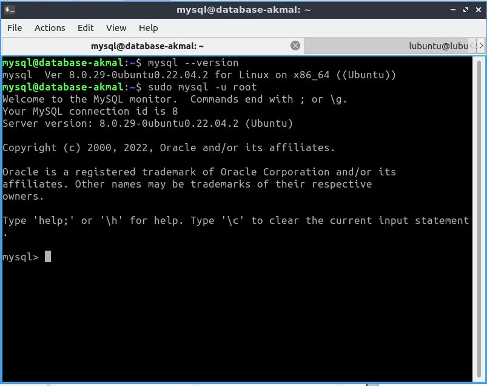

Untuk melihat versi gunakan perintah 

```
mysql --version
```

Untuk masuk ke mysql gunakan perintah

```
sudo mysql -u root
```


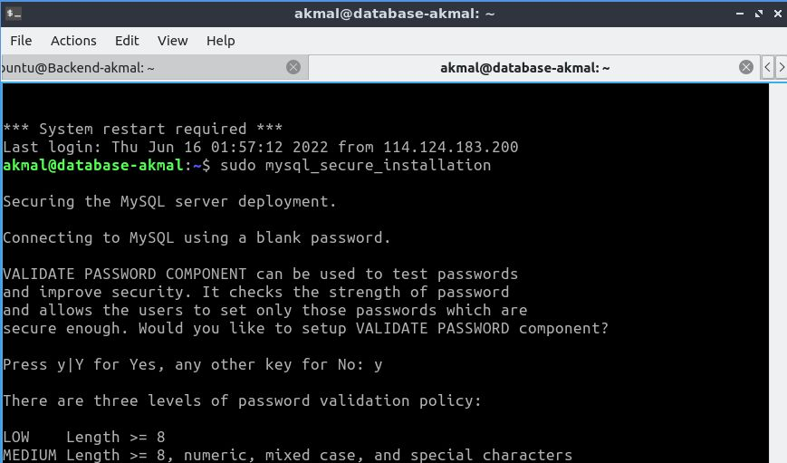

Jalankan skrip keamanan dengan sudo (Keluar terlebih dahulu dari mysql)

```
sudo mysql_secure_installation

```
kemudian isi password yang akan kalian inginkan


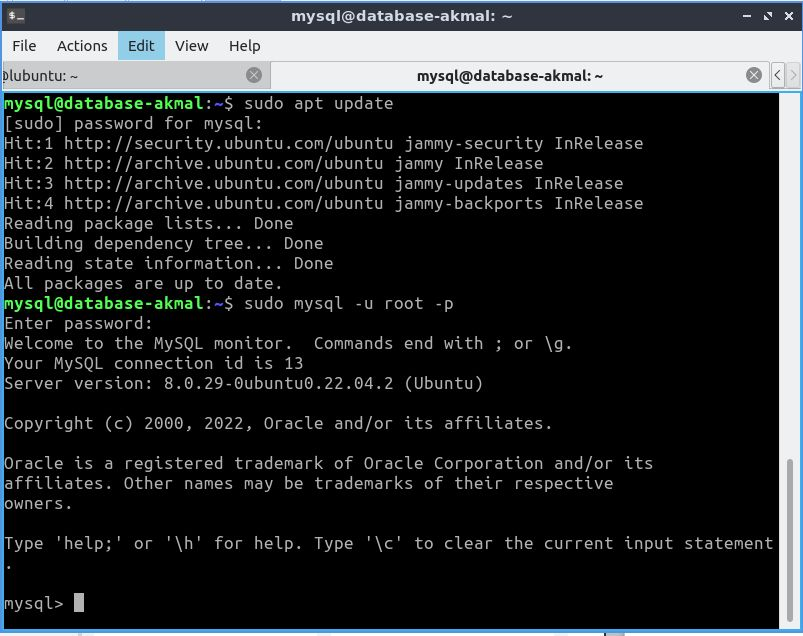

Lalu login ulang menggunakan password dengan

```
sudo mysql -u root -p
```

# Membuat Database Baru pada user baru

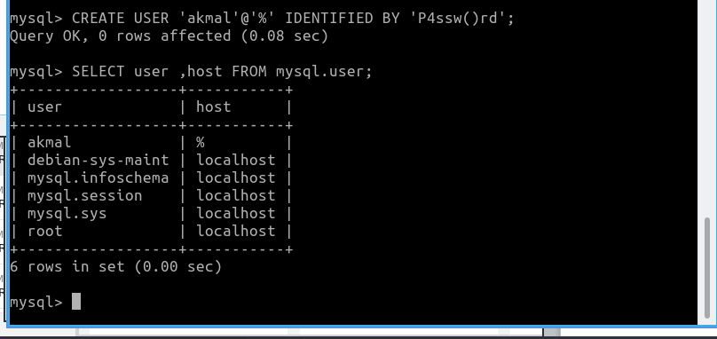


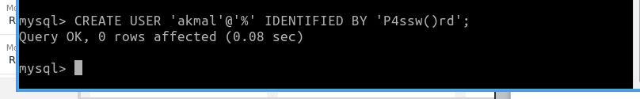


Untuk membuat pengguna yang dapat terhubung dari host mana pun, gunakan wildcard ‘%‘ sebagai bagian host:

```
CREATE USER 'user_database'@'%' IDENTIFIED BY 'password_user';
```

Opsi ini biasanya digunakan oleh para webmaster yang menginginkan MySQL server ditempat terpisah dengan web server.

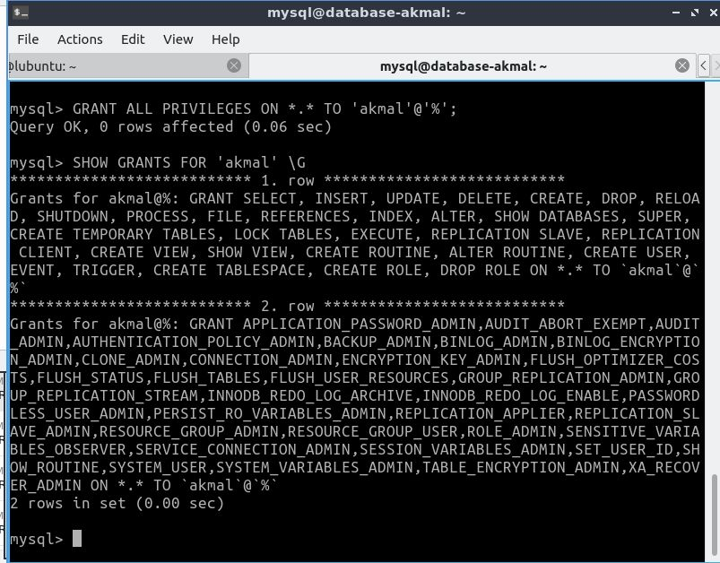


Memberikan semua hak istimewa ke akun pengguna untuk semua database :

```
GRANT ALL PRIVILEGES ON *.* TO 'user_database'@'localhost';
```

Kemudian 
```
FLUSH PRIVILEGES;
```


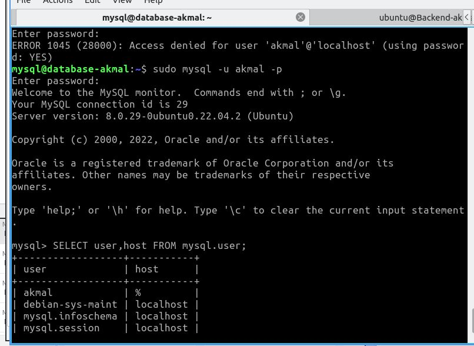

Kemudian saya login dengan user baru yang tadi di buat


```
SELECT user,host FROM mysql.user;
```

# Membuat database wayshub pada mysql


```
CREATE DATABASE wayshub;
```

Untuk melihat isi dari database gunakan perintah

```
show databases;
```

# Mengganti bind address

Fungsi melakukan bind address yaitu supaya database dapat di akses oleh client

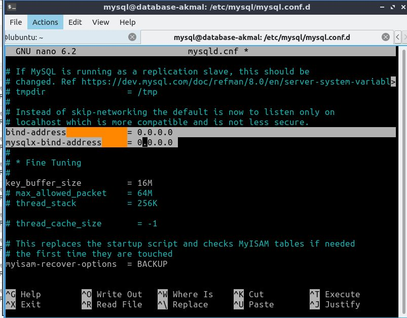


```
bind-address            = 0.0.0.0  
mysqlx-bind-address     = 0.0.0.0 
```


Lalu restart mysql

```
systemctl restart mysql.service
```

# Dapat meremote database dari client

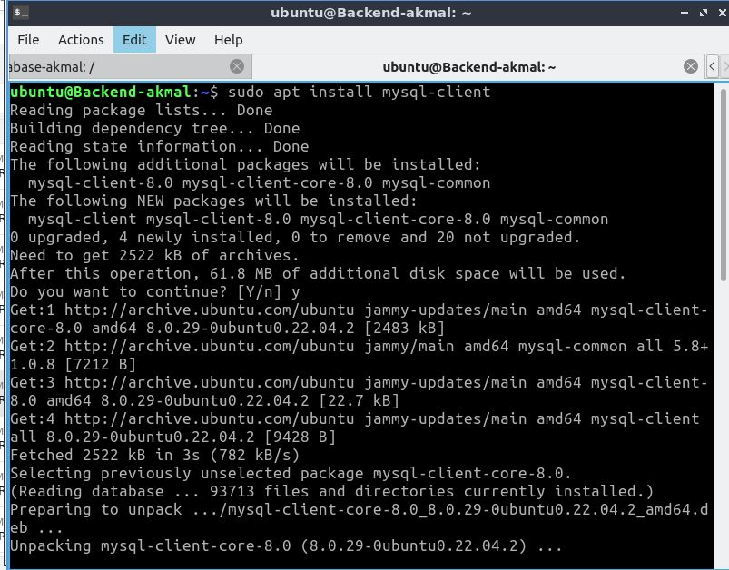

```
sudo apt install mysql-client
```

Gunakan perintah diatas untuk menginstall mysql untuk client supaya client dapat meremote database

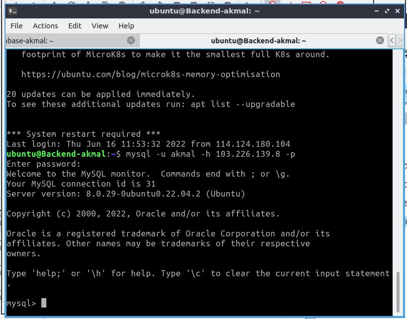


```
mysql -u alfino -h 116.193.190.66 -p
```

# Deployment

Cloning fork https://github.com/dumbwaysdev/wayshub-backend

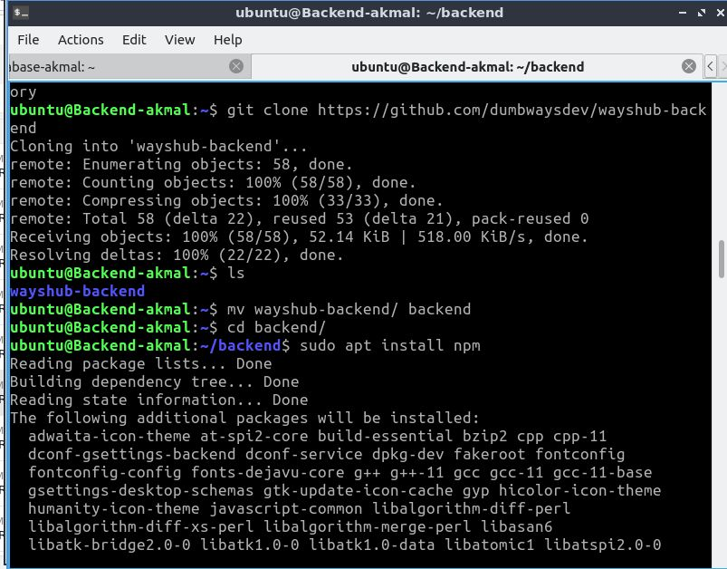

```
git clone https://github.com/dumbwaysdev/wayshub-backend
```

Mengubah direktori menjadi backend dan deploy aplikasi menggunakan PM2


Karena disini saya akan mendeploy aplikasi frontend dengan konfigurasi node js jadi terlebih dahulu saya akan menginstall NPM (Node Package Manager) dan NVM (Node Version Manager) terlebih dahulu


```
sudo apt install npm
```

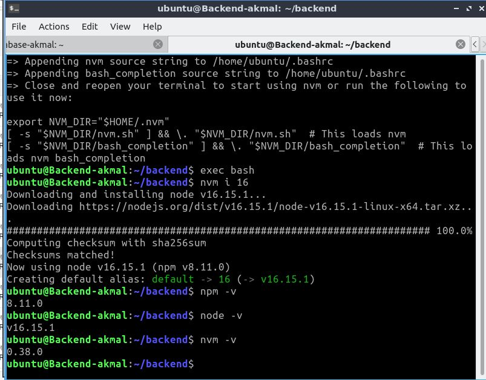


Selanjutnya saya akan Install NVM (Node Version Manager) menggunakan link di bawah ini

```
curl -o- https://raw.githubusercontent.com/nvm-sh/nvm/v0.38.0/install.sh | bash
```

```
exec bash
```


# Migrasi data backend ke Database


Edit file config.json pada /backend/config

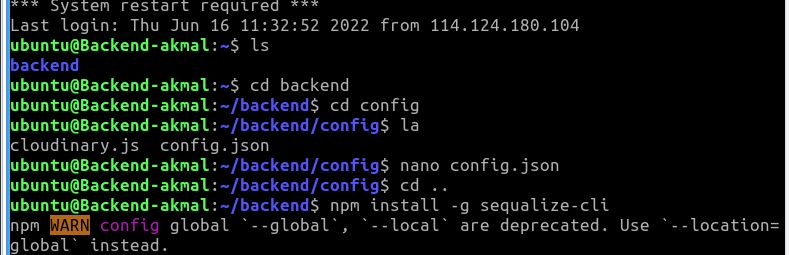

```
npm install -g sequelize-cli
```


```
npx sequelize db:migrate
```
Setelah itu cek pada database

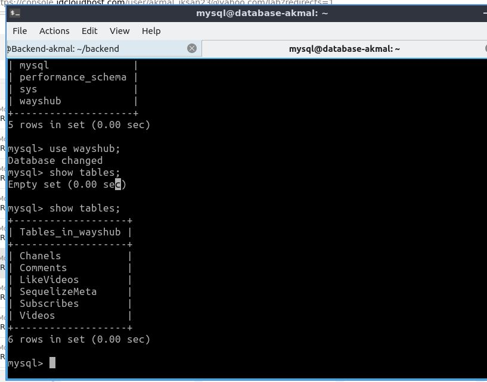

Proses migrasi berhasil

# Install PM2


Untuk [Instalasi PM2](https://pm2.keymetrics.io/docs/usage/quick-start/) gunakan perintah

```
npm install pm2
```

Kemudian kita perlu membuat file ecosystem untuk menjalankan backend


```
pm2 ecosystem simple
```


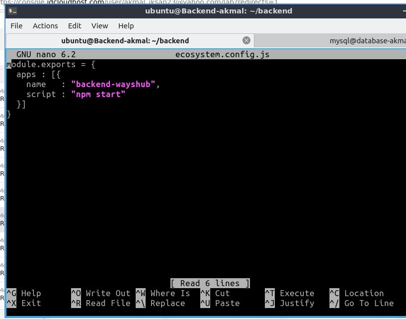

```
module.exports = {
  apps : [{
    name   : "backend-wayshub",
    script : "npm start"
  }]
}
```

Lalu jalankan pm2 menggunakan perintah

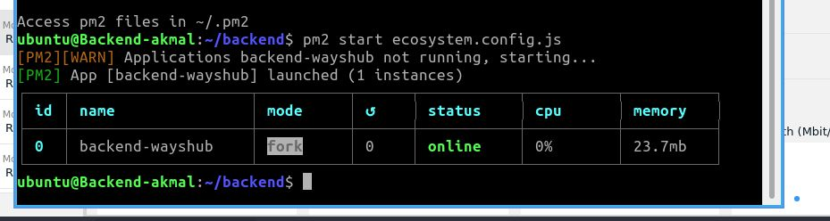


```
pm2 start ecosystem
```


# Mengoneksikan aplikasi frontend dan backend

Sebelum mengoneksikan aplikasi frontend dan backend kita perlu mengatur domain untuk backend


Disini saya menggunakan domain dari [CloudFlare](cloudflare.com) , ke menu dns dan buat domain

Domain yang saya buat untuk backend yaitu api.alfino.studentdumbways.my.id 

Kemudian saya akan membuat reverse proxy untuk server backend menggunakan domain api.akmal.studentdumbways.my.id 

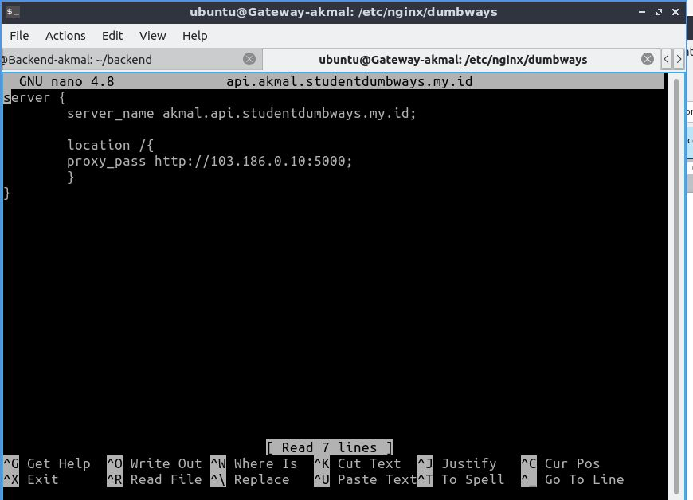

buka direktori /etc/nginx/dumbways kemudian buat file reverse proxy baru 

```
server { 
        server_name akmal.api.studentdumbways.my.id; 

        location /{
        proxy_pass http://103.172.204.30:5000;
        }
}
```

# Menggunakan SSL CertBot untuk memperaman website

#Apa itu SSL ?

SSL adalah singkatan dari Secure Socket Layer, salah satu komponen penting yang harus dimiliki website. Dengan SSL, transfer data di dalam website menjadi lebih aman dan terenkripsi. Bahkan saking pentingnya, Google Chrome melabeli website tanpa sertifikat SSL sebagai Not Secure.

Apabila sistem keamanan ini ditambahkan pada website Anda, maka URL website akan berubah menjadi HTTPS. Tujuan utama pemasangan SSL adalah sebagai pengaman pertukaran data yang terjadi melalui jaringan internet.


```
sudo snap install core; sudo snap refresh core
```


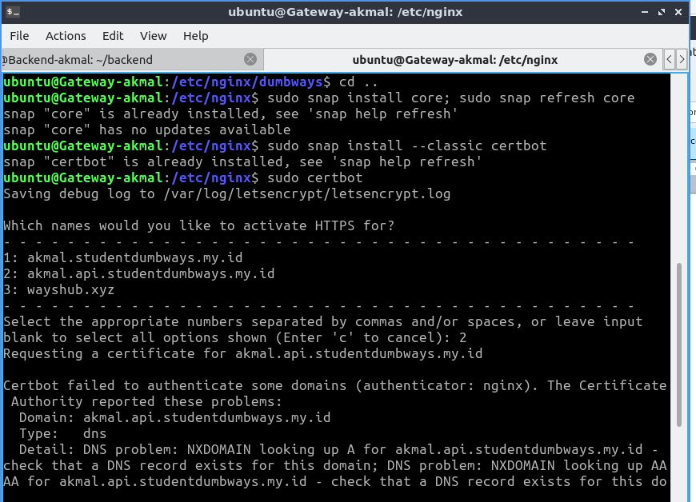


```
sudo snap install --classic certbot
```


Jalankan certbot menggunakan perintah


```
sudo certbot
```


Konfigurasi SSL / HTTPS pada server backend berhasil


---------------------------

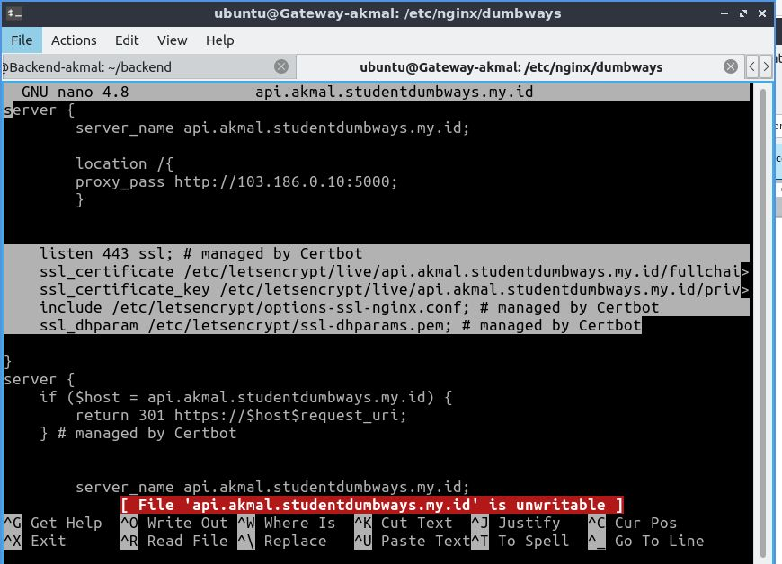

Masuk ke server frontend kemudian masuk pada direktori wayshub-frontend

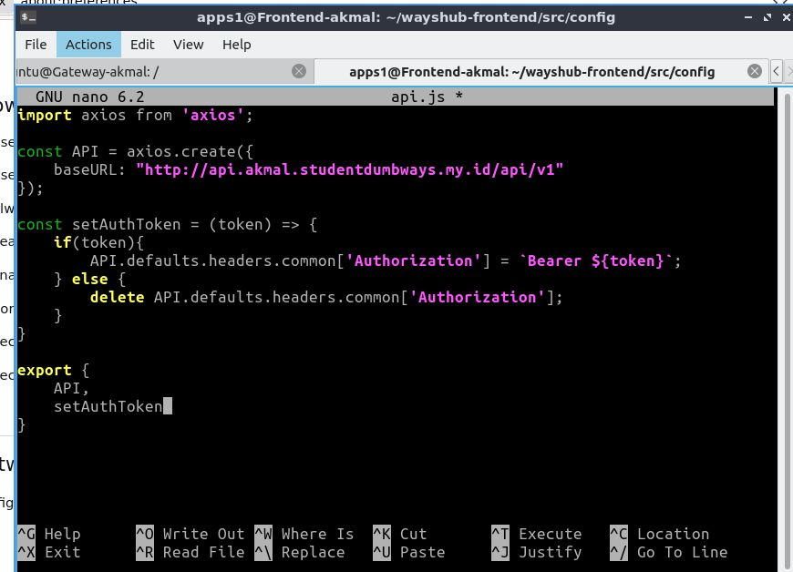

Masuk pada direktori aplikasi/wayshub-frontend/src/config kemudian edit file api.js , isi gunakan domain backend

```
import axios from 'axios';

const API = axios.create({
    baseURL: "https://api.akmal.studentdumbways.my.id/api/v1"
});

const setAuthToken = (token) => {
    if(token){
        API.defaults.headers.common['Authorization'] = `Bearer ${token}`;
    } else {
        delete API.defaults.headers.common['Authorization'];
    }
}

export {
    API,
    setAuthToken
}
```

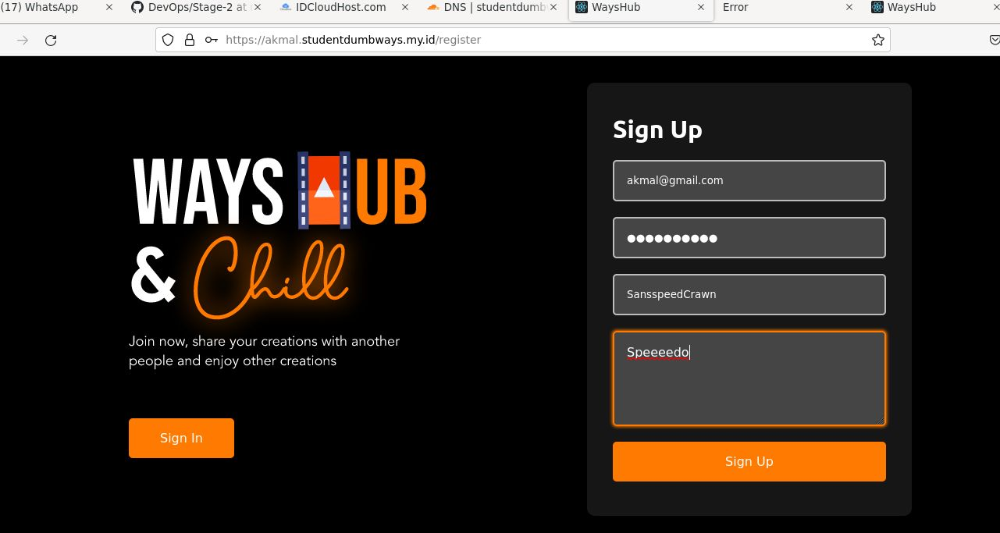

Kemudian tes menggunakan web browser dan registrasi

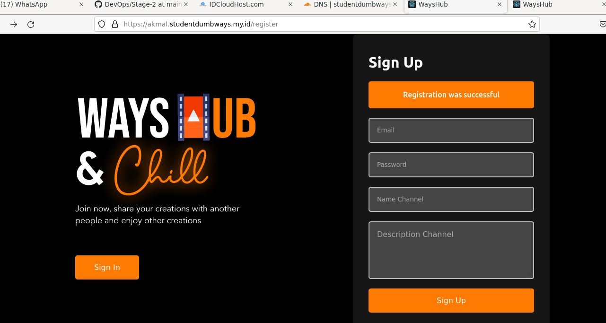

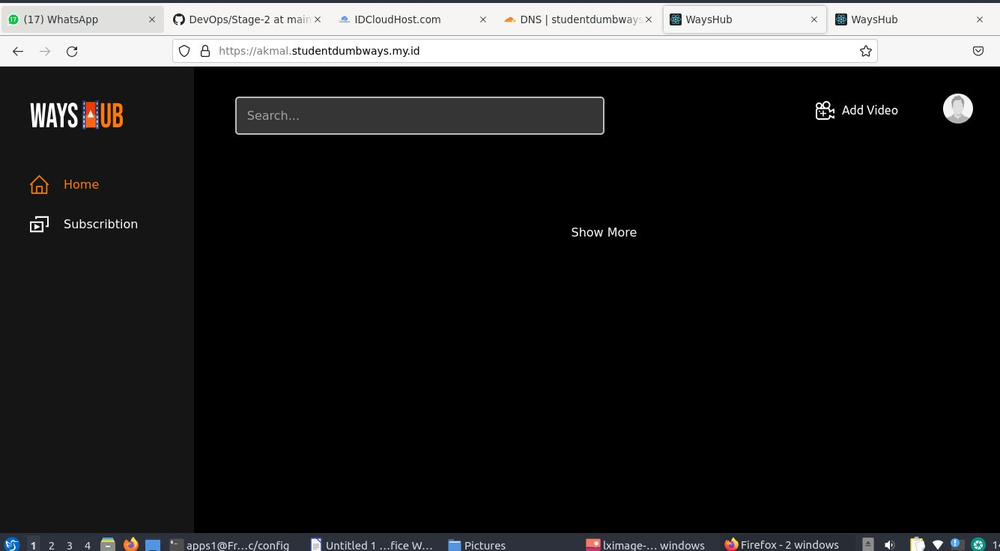

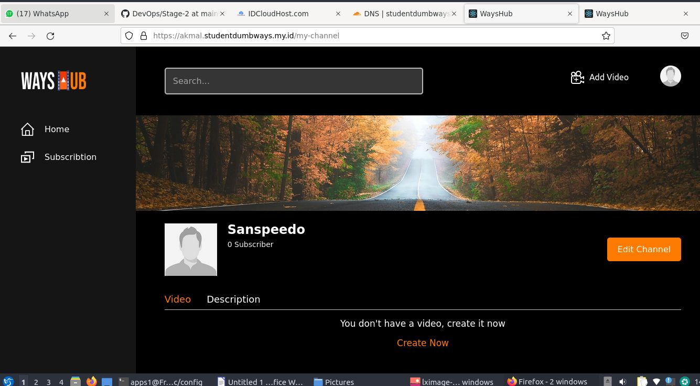


Semua berjalan normal apabila tidak ada error

