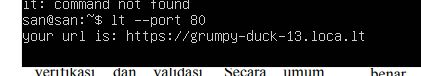

# Task 2 Day 2

# Instalasi Apache2 dan Tunneling

## Step 1 - Setting IP

1. langkah awal mensetting IP terlebih dahulu jika menggunakan jaringan bridge, maka kita gunakan IP dalam satu network dengan cara berikut:

```
sudo nano /etc/netplan/00-installer-config.yaml
```
Akan muncul sebagai berikut lalu ubah IP nya


2. Setelah selesai men-setting IP maka kita coba gunakan perintah `ping google.com` untuk mengetes koneksi dan jika berhasil maka akan muncul seperti gambar berikut


# Step 2

## Apache2 Installation

1. Untuk mengecek IP yang sudah kita ubah tadi kita akan coba dengan remote server. Caranya dengan perintah berikut 

```
ssh san@192.168.43.250
```
Untuk san kalian ganti dengan username Ubuntu Server kalian sendiri, jika ssh berhasil maka akan muncul seperti gambar berikut:


2. Back to Ubuntu Server,  di server kita melakukan update dan upgrade terlebih dahulu agar system kita up-to-date dengan cara berikut:

```
sudo apt update; sudo apt upgrade
```

3. Setelah update dan upgrade selanjutnya kita akan mulai menginstall Apache2 dengan menggunakan perintah

```
sudo apt install apache2
```
ketika muncul "Do you want to continue?" ketik Y dan enter maka instalasi akan mulai berjalan


Jika sudah muncul seperti gambar berikut maka instalasi Apache2 sudah berhasil

4. Selanjutnya kita akan mengecek status apache2 apa sudah aktif atau belum dengan perintah:

```
sudo systemctl status apache2
```
Jika apache2 berhasil Aktif/Running maka akan muncul seperti gambar berikut:


Dan kita juga kita akan mengecek apache2 di web browser apakah berjalan


Dan instalasi Apache2 BERHASIL

# Step 3 - LocalTunnel

1. Lakukan instalasi node.js menggunakan nvm, dan untuk melakukannya kita harus install curl terlebih dahulu menggunakan perintah berikut

```
sudo apt install curl
```
2. Kemudian setelah install curl maka kita akan mendownload nvm menggunakan curl dengan cara

```
curl -o- https://raw.githubusercontent.com/nvm-sh/nvm/v0.39.1/install.sh | bash
```
3. Kemudian lakukan eksekusi bash dan instalasi nvm dengan cara

```
exec bash
```
```
nvm install 14
```
4. Untuk mengecek apakah instalasi node.js dan nvm berhasil maka gunakan perintah berikut

```
node -v
```
```
npm -v
```


5. Sekarang kita akan melakukan instalasi localtunnel dengan perintah berikut

```
npm install -g localtunnel
```
6. Jika instalasi localtunnel sudah selesai sekarang kita akan menjalankan localtunnel pada Apache2 kita dengan cara perintah berikut
  
```
lt --port 80
```
Dan dibawahnya akan muncul url localtunnel kita yang mana telah online dan bisa diakses di browser manapun seperti gambar berikut:



7. Dan sekarang kita coba URL localtunnel kita di browser, melalui HP atau
PC:

Tampilan Browser PC:


Tampilan Browser HP:


# BRAVOOO ANDA TELAH BERHASIL !


