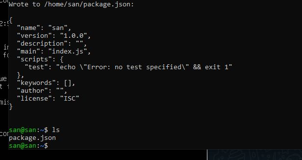
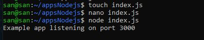

# Task 3 Day 3

# Build dan Running aplikasi NodeJS, Golang dan Python3 dan Jalankan Secara Daemon Menggunakan PM2

## Step 1 - Instalasi, Build dan Run Aplikasi NodeJS

1. Install terlebih dahulu engine NodeJS dengan cara perintah berikut:
  
```
curl -o- https://raw.githubusercontent.com/nvm-sh/nvm/v0.38.0/install.sh | bash
```


Note:
- nvm merupakan singkatan dari Node Version Manager. nvm adalah sebuah program yang akan membantu kita untuk menggunakan lebih dari satu versi Nodejs di dalam satu komputer.
Jika nvm belum terdeteksi gunakan perintah berikut:

```
exec bash
```

Kemudian lakukan instalasi dengan perintah berikut:
  
```
nvm install 16
```
Lalu untuk menggunakan nvm versi 16 kita gunakan perintah berikut
```
nvm use 16
```
Untuk mengecek versi node menggunakan perintah berikut:
```
node -v
```
Dan untuk mengecek versi npm menggunakan perintah berikut:
```
npm -v
```


2. Buatlah directory untuk aplikasi NodeJS saya kemudian menggunakan perintah `npm init -y` untuk inisialisasi project saya, 
  hasilnya adalah perintah tersebut akan membuat file baru dengan nama package.json, package.json ini berisikan isi informasi dari aplikasi yang akan kita buat nanti
```
npm init -y
```


3. Lalu menginstall ExpressJS. Express JS adalah framework dari NodeJS yang dirancang secara fleksibel dan sederhana untuk membantu tahap pengembangan aplikasi back end, untuk menginstall express js gunakan perintah berikut:

```
npm install express --save
```


4. Sekarang kita akan membuat file baru dengan nama index.js dengan perintah berikut:

```
touch index.js
```
Dan untuk edit file index.js gunakan perintah berikut:
```
nano index.js
```


Kemudian masukkan script berikut:

```
const express = require("express");
const app = express();
const port = 3000;

app.get("/", (req, res) => {
  res.send("Hello World!");
});

app.listen(port, () => {
  console.log(`Example app listening on port ${port}`);
});
```
Dan tekan ctrl+x dan y dan enter untuk save


5. Dan file berhasil dibuat! Sekarang kita akan menjalankan file index.js tadi dengan perintah berikut:
  
```
node index.js
```


6. Dan jika sudah muncul seperti gambar diatas maka aplikasi sudah berhasil dijalankan, untuk mengetes kita akan mencoba di web browser local seperti gambar berikut:


Dan dapat dilihat di gambar diatas aplikasi kita berhasil berjalan di web browser tanpa masalah


# Step 2 - Instalasi, Build dan Run Aplikasi Golang

1.Kembali ke directory root, disini saya membuat directory baru untuk aplikasi golang kita dan mendownload engine Golang dengan perintah berikut:

Untuk membuat directory:

```
mkdir aplikasi-go-saya
```
Untuk mendonwnload engine Golang:

```
wget https://golang.org/dl/go1.16.5.linux-amd64.tar.gz && sudo su
```



2. Kemudian masuk ke path go pada `.bashrc` dengan perintah berikut:
  
```
sudo nano .bashrc
```


3. Tambahkan `export PATH=$PATH:/usr/local/go/bin` di bagian paling bawa pada file .bashrc seperti gambar berikut:


4. Kemudian kita check apakah Go sudah terinstall dengan baik, jika sudah maka akan seperti gambar berikut:

```
go version
```

5. Sekarang saya akan membuat file go dan meng-editnya dengan menggunakan perintah berikut:
Untuk membuat file index.go:
```
touch index.go
```
Untuk mengedit gunakan perintah berikut:
```
nano index.go
```

6. Kemudian masukkan script berikut kedalam file index.go tadi:

```
package main

import "fmt"

func main() {
    fmt.Println("Hello World!")
}
```

7. Lalu kita coba run aplikasi go tadi dengan perintah berikut:

```
go run index.go
```
Jika berhasil akan seperti gambar berikut:

8. Untuk build aplikasi go gunakan perintah berikut:

```
go build index.go
```

9. Lalu jalankan aplikasi go yang telah kita build tadi dengan perintah berikut:

```
./index
```


# Step 3 - Instalasi, Build dan Run Aplikasi Python3

1. Aplikasi python telah di install secara default pada Ubuntu, maka kita tidak perlu mendownload nya lagi, untuk mengecek apakah python3 sudah ada gunakan
perintah berikut:

```
python3
```


2. Sekarang kita akan menginstall package manager dari python yaitu PIP dengan perintah berikut:
  
```
sudo apt install python3-pip
```


3. Setelah itu kita akan menginstall flask dengan perintah berikut:

```
pip install flask
```


Note :
- PIP adalah sebuah package management system yang biasa digunakan untuk mengatur dan menginstall package yang berisi modul-modul Python. PIP digunakan untuk menginstall Flask karena Flask ditulis dan dikembangkan dengan bahasa dan modul-modul pemrograman Python. Dengan menggunakan PIP, semua hal yang dibutuhkan untuk instalasi Flask akan diunduh dan dipasang dalam satu perintah.
4. Sekarang kita akan membuat file python kita dan mengedit nya


5. Masukkan script berikut kedalam file index.py kita 

```
from flask import Flask
app = Flask(__name__)
@app.route("/")
def helloworld():
    return "Hello World"
if __name__ == "__main__":
    app.run()
```


6. kemudian jalankan file index.py kita tadi dengan menggunakan perintah berikut:

```
python3 index.py
```
Dan jika berhasil akan seperti gambar berikut:


Langkah 4 - Menjalankan Aplikasi Secara Daemon Menggunakan PM2
1. Lakukan instalasi PM2 dengan perintah berikut:

```
npm install pm2 -g
```


2. Kemudian masuk ke directory NodeJS dan start aplikasi NodeJS kita secara daemon dengan perintah berikut:
  
```
pm2 start index.js
```


3. Dan aplikasi NodeJS kita berhasil dijalankan di PM2 secara daemon seperti gambar berikut:


4. Sekarang kita akan menjalankan aplikasi python kita dengan cara masuk terlebih dahulu ke directory python dan masukkan perintah berikut:

```
pm2 start index.py --interpreter python3
```
Dan aplikasi Python3 kita berhasil dijalankan di PM2 secara daemon seperti gambar berikut:


5. Sekarang kita akan masuk ke aplikasi Golang kita dan menjalankannya secara daemon dengan perintah berikut:

```
pm2 start index.go
```


6. Sekarang kita akan mengecek status keseluruhan dengan perintah berikut apakah berjalan dengan baik atau tidak
```
pm2 status
```

  
Langkah 5 - Localtunnel
1. Karena localtunnel telah di install maka kita langsung jalankan localtunnel di aplikasi python dan nodejs dengan perintah berikut:
Untuk Aplikasi python disini menggunakan port 5000 dengan perintah:

```
lt --port 5000
```


Untuk Aplikasi NodeJS disini menggunakan port 300 dengan perintah:

```
lt --port 3000
```


# BRAVOOO ANDA TELAH BERHASIL !


