# Task 4 Day 4

# GIT Configuration

## Step 1 - Konfigurasi GIT

1. Jika menggunakan sistem operasi Linux-Ubuntu/Mac OS maka kita tidak perlu install GIT lagi karena GIT sudah ada secara default, maka langkah pertama yang kita
lakukan adalah konfigurasi GIT kita dengan menetapkan username dan email akun Github kita dengan menggunakan perintah
  
```
git config --global user.name " *your.github-user.name* "
```
```
git config --global user.email " *your.github-user.email* "
```
Ubah kata berbintang dengan username dan email kalian dan pastikan sesuai dengan akun github kalian


# Step 2 - SSH 
1. SSH key berguna untuk mengintegrasikan antara repository local kita dengan platform github, kita akan generate SSH dengan menggunakan perintah berikut:

```
ssh-keygen
```
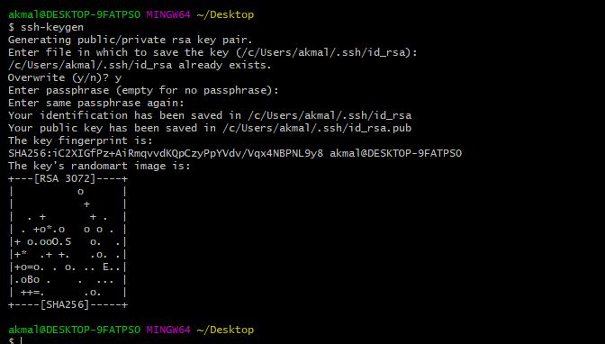

2. Kemudian kita masuk ke directory ssh yang telah kita buat tadi dengan perintah berikut:
```
cat .ssh/id_rsa.pub
```
Dan copy isi dari file id_rsa.pub yang dilingkari merah tersebut untuk kita pakai di step 4 nanti

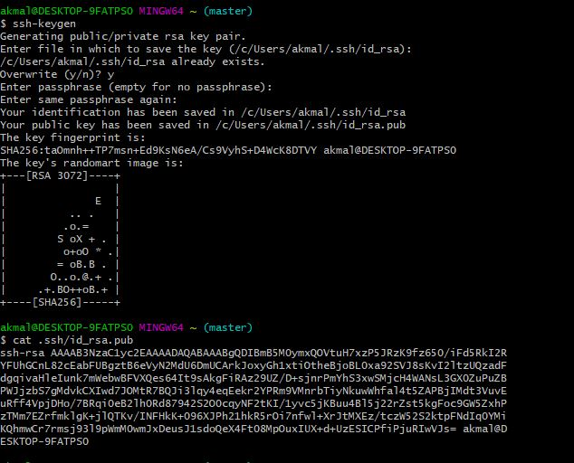

3. Kemudian masuk ke Web github dan pilih settings di pojok kanan atas profil kita kemudan klik settings. Setelah itu pada halaman settings masuk ke tab
  SSH and GPG keys kemudian klik New SSH Key seperti gambar berikut:

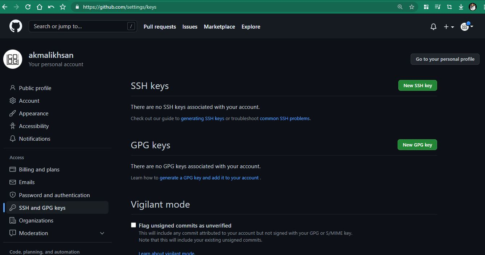

4. Kemudian masukkan title sesuai keinginan kita dan key SSH yang telah kita copy di step 2 tadi di kolom Key dan klik Add SSH key

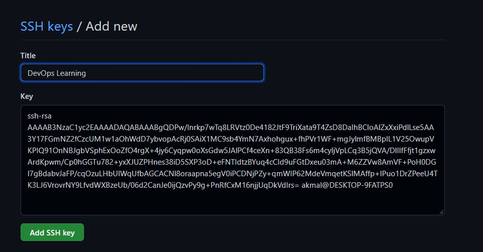

5. Jika berhasil maka akan muncul seperti ini di halaman SSH Keys kalian

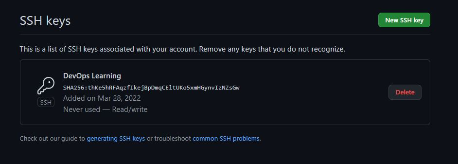

6. Sekarang kita akan cek koneksi antara Local kita dengan Github dengan perintah berikut:
  
```
ssh -T git@github.com
```


7. Sekarang kita akan membuat repository di masing-masing 3 directory yaitu di directory aplikasi NodeJS,Golang, dan Python kita. Untuk sekarang kita akan membuat
  repository di directory Nodejs kita dengan perintah berikut:

```
git init
```
Dan secara otomatis GIT akan membuat repository di directory aplikasi NodeJS kita


8. Kemudian kita buat juga repository di web Github kita dengan klik pada pojok kanan atas dan klik "New Repository"

9. Masukkan nama repository nya dan klik "Create Repository


Jika muncul seperti gambar berikut maka repository telah berhasil dibuat dan copy pada bagian git remote add untuk digunakan pada step 10


10. Sekarang kita buat git remote dengan perintah yang telah kita copy tadi yaitu:

```
git remote add origin git@github.com:AkmalFounder/nodejs.git
```


11. Sekarang kita akan membuat .gitignore untuk node modules yang mana fungsinya untuk mengecualikan file/folder yang tidak akan di deploy ke github,
  dikarenakan node modules ini mempunyai banyak isi yang tidak diperlukan untuk di deploy dengan perintah berikut:

Pertama kita buat terlebih dahulu file .gitignore
```
touch .gitignore
```
Kemudian edit file .gitignore nya
```
nano .gitignore
```
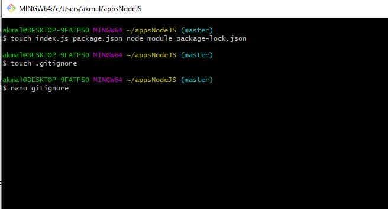

Kemudian kita masukkan nama file/folder yang akan kita jadikan pengecualian seperti gambar berikut:


Kemudian kita cek di git status dan node modules sudah ada di pengecualian dan tidak akan di deploy ke github

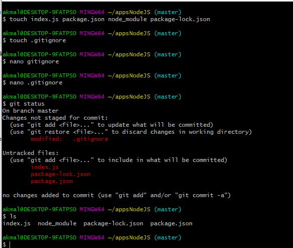

12. Sekarang kita git add semua file di dalam folder NodeJS kita dengan perintah berikut:
Fungsi . adalah semua file didalam folder itu akan ditambah dan siap untuk di commit
```
git add .
```
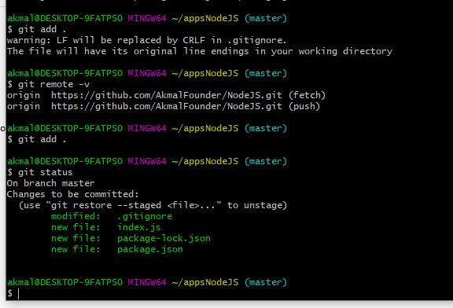

13. Sekarang kita akan melakukan commit untuk persiapan ke tahap production dengan perintah berikut:
```
git commit -m "task4"
```

14. Sebelum melakukan push, kita lihat branch yang kita gunakan terlebih dahulu dan push ke branch tersebut dengan perintah berikut:
```
git branch -a
```
Dan lakukan push dengan perintah berikut:
```
git push origin master
```


Dan aplikasi kita berhasil di push.

15. Kita cek di Github kita apakah aplikasi telah berhasil di push apa tidak

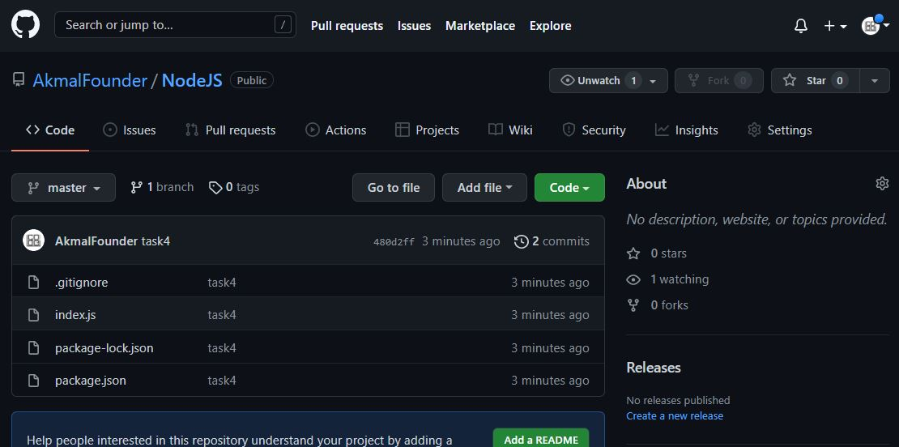

Dan jika seperti gambar diatas berarti push berhasil
16. Sekarang kita akan berpindah ke branch development menggunakan perintah berikut:
```
git branch -m development
```
Dan kita cek apakah perpindahan berhasil dengan perintah
```
git branch -a
```


17. Sekarang kita akan membuat 2 branch lagi yaitu staging dan production dengan perintah berikut:
```
git branch *nama branch*
```

Dan cek lagi dengan `git branch -a`


18. Kemudian lakukan push ke branch development,staging dan production


19. Kita cek 3 branch tadi apakah sudah selesai dengan membuka github kita dan jika berhasil seperti gambar dibawah ini


20. Dan untuk berpindah ke branch lainnya menggunakan
```
git checkout staging
```
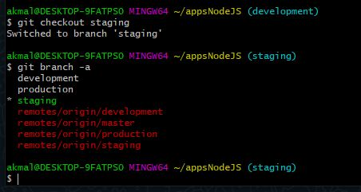

21. Sekarang kita akan beralih ke directory golang kita
Disini saya melakukan inisialisasi git menggunakan perintah `git init` kemudian membuat file .gitignore dan menambahkan file gol1.16.5.linux-amd64.tar.gz, 
jadi file tersebut tidak akan di deploy, kemudian saya melakukan `git add .` dan `git commit -m "first commit"`

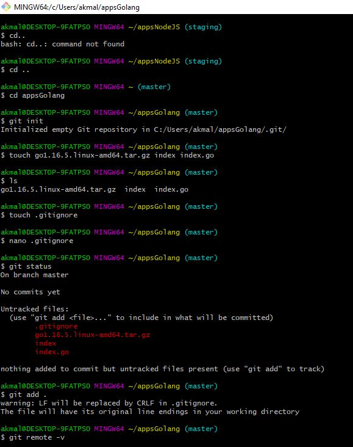

22. Setelah itu saya membuat 3 branch yaitu development, staging dan production

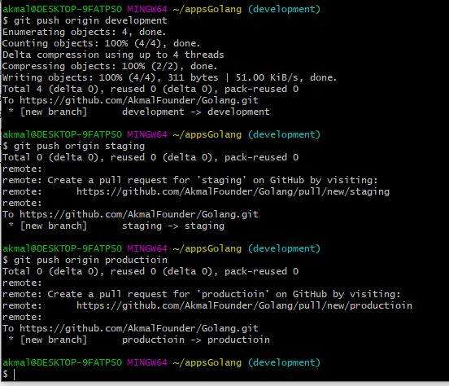>

23. Disini saya membuat remote origin ke repository Golang kita, kemudian saya melakukan push ke setiap branch dengan menggunakan remote
  origin


Lalu kita cek apakah branch nya sudah ada dan berhasil di push 

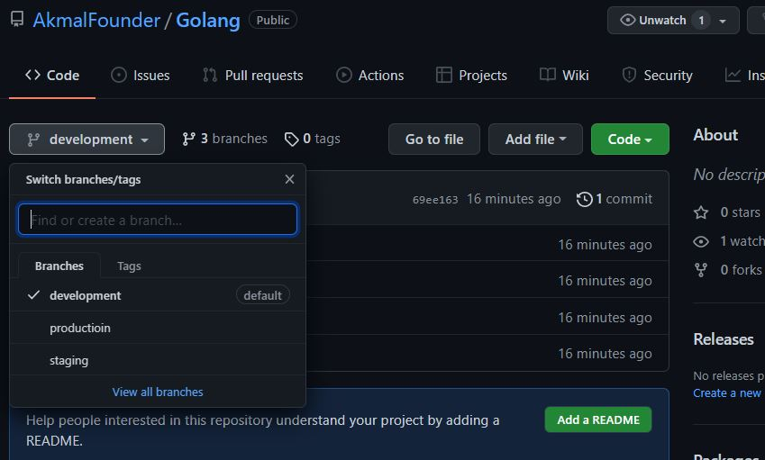

# Demikian juga untuk repository Python

# BRAVOOO ANDA TELAH BERHASIL !


