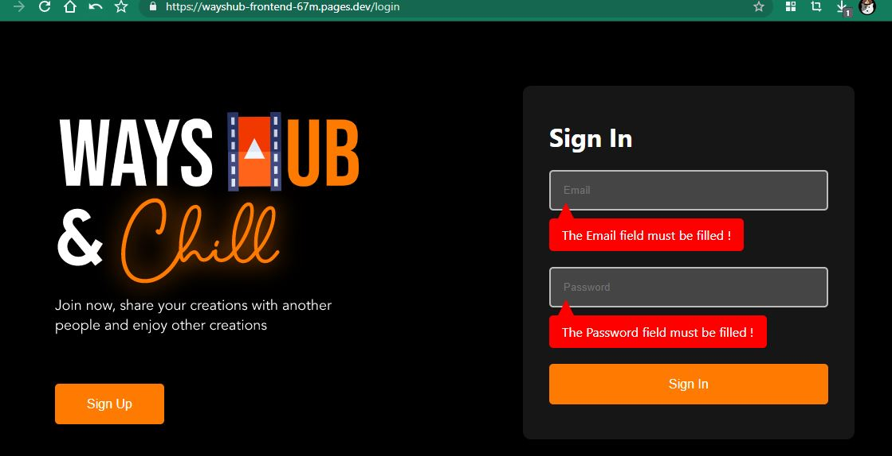

# Task 5 Day 5

# Konfigurasi CI/CD menggunakan Cloudflare

## Step 1 - Daftar Akun Cludflare

1. Sebelum mulai kita harus mendaftar terlebih dahulu pada link https://dash.cloudflare.com/sign-up kemudian masukkan email dan password yang akan kalian daftarkan

# Step 2 - Konfigurasi dan menggunakan CI/CD Cloudflare 
1. Login terlebih dahulu menggunakan akun yang kalian daftarkan tadi kemudian setelah login berikut halaman awal dan klik pages di tab sebelah kiri seperti
gambar berikut:

2. Setelah itu klik "Create a project" seperti gambar berikut:

3. Kemudian kita akan mengkoneksikan antara cloudflare dengan akun github kita dengan cara klik "Connect Github"

4. Kemudian kita akan diarahkan ke website Github dan kalian pilih "Only select repositories" kemudian pilih repository yang ingin kalian gunakan 
di cloudflare pages seperti gambar berikut:

5. Jika sudah selesai klik "Install & authorize"

6. Kemudian masukkan password Github kalian

7. Jika sudah maka kita akan kembali ke halaman Cloudflare, jangan lupa di centang pada bagian repository kalian dan klik "Begin setup"

8. Disini kita akan mengkonfigurasi CI/CD kita, masukkan project name yang kalian inginkan kemudian pilih branch kalian

Disini kita akan konfigurasi build nya, pilih framework yang kalian gunakan di repository yang sudah kalian pilih tadi, disini saya menggunakan
React maka saya memilih Create React App, kemudian di "Build Command" akan terganti sesuai rekomendasi framework yang kita pilih tadi, dan untuk build biarkan default
rekomendasi

Pada bagian ini Root directory saya sudah benar berada di "/" dan Untuk "Environment variables" saya kosongkan karena tidak ada backend didalam project ini hanya
front end saja

9. Sekarang kita tunggu sampai proses build selesai dan di deploy

10. Jika proses build dan deploy berhasil maka akan muncul gambar berikut dan kita akan copy link yang telah diberikan untuk di tes 

11. Dan setelah di tes proses deploy berhasil, web dapat diakses dengan sempurna

12. Dan seperti ini status dari CI/CD kita tadi

13. Kemudian saya akan melakukan perubahan di Github untuk melihat apakah CI/CD kita berjalan dengan baik dengana mengubah Title menjadi 
Wayshub -  Akmal Ikhsan

14. Dan secara otomatis CI/CD kita akan melakukan proses build dan deploy dengan sendirinya dapat dilihat di status berikut:

15. Dapat dilihat Log dari proses build kita

16. Dan jika proses CI/CD berhasil maka Log kita akan memberitahu kita.

17. Dapat dilihat hasil CI/CD berjalan dengan baik dan web yang tadinya title hanya "Wayshub" sekarang berubah menjadi "Wayshub -  Akmal Ikhsan"
yang artinya proses CI/CD kita berhasil!

# BRAVOOO ANDA TELAH BERHASIL !

