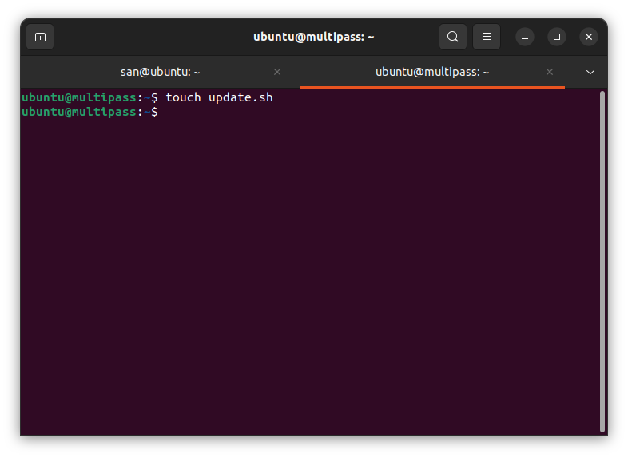
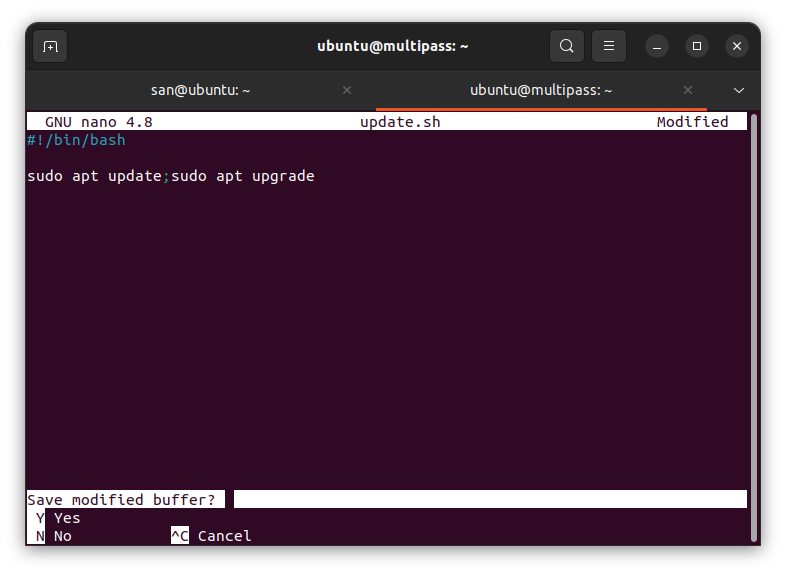
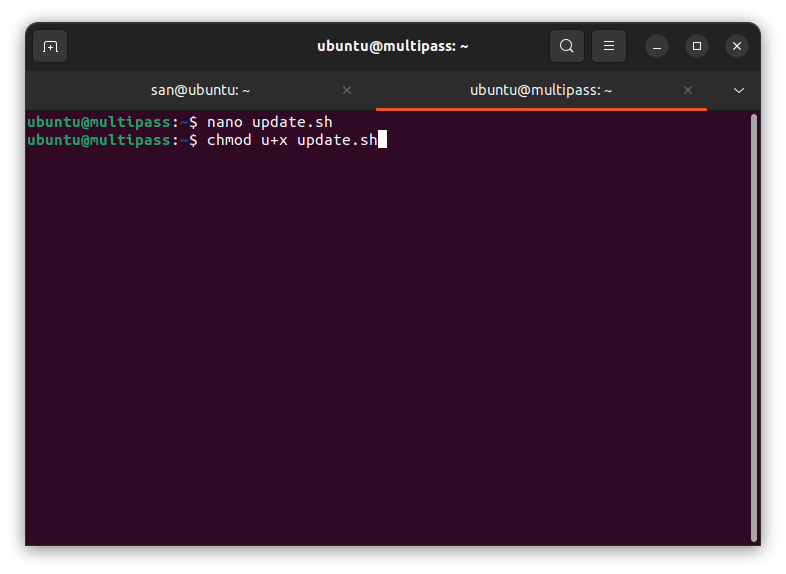
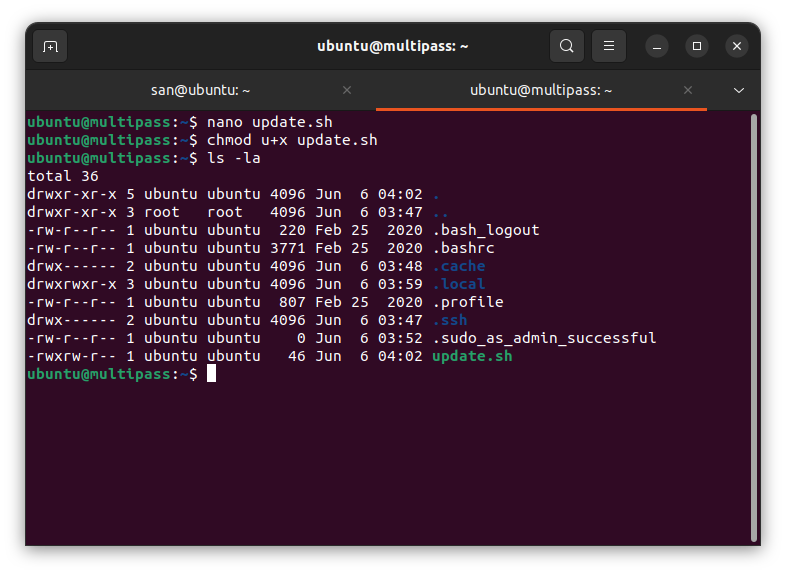
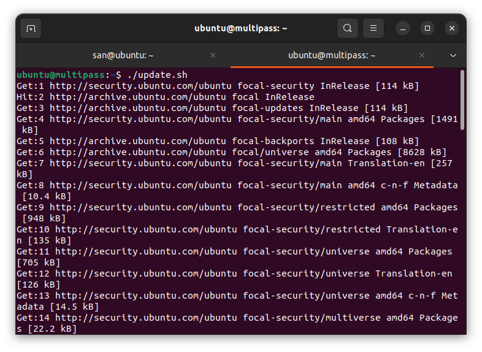
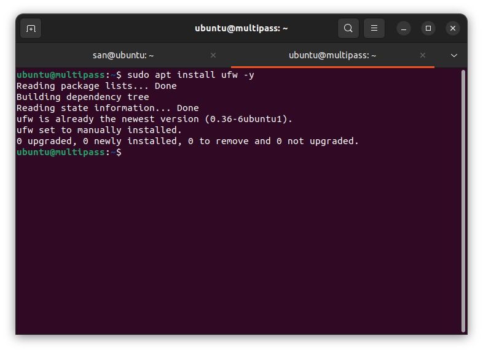

# Langkah 1

1. buatlah file yang ber extension .sh

2. lalu masukan script 

#!/bin/bash

sudo apt update;sudo apt upgrade

3. setelah itu buat lah file tersebut agar bisa di execute dengan cara

chmod u+x update.sh

-- maka akan jadi seperti ini statusnya

4. lalu jalankan program terserbut dengan cara mengetik perintah ./update.sh

5. maka akan jalan seperti ini

