# Task Day 7

## Web Server?

Web Server adalah sebuah software yang memberikan layanan berupa data. Berfungsi untuk menerima permintaan HTTP atau HTTPS dari client atau di kenal dengan web browser (chrome atau firefox). Kemudian web server akan mengirimkan respon atas permintaan tersebut dalam bentuk halaman web.

# Langkah 1 - Install VM terlebih dahulu


1.disini saya membuat 3 buah server, : 1.Server multipass, server1 dan server2 nya untuk server aplikasi :

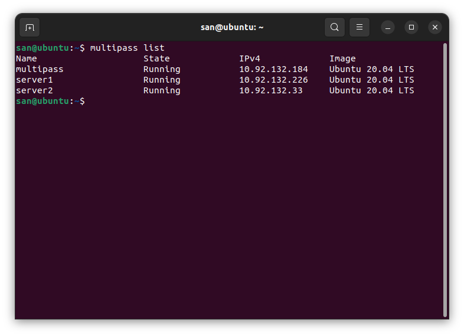


# Langkah 2 - Instalasi NGinx Web Server Di Multipass Server

1.Langkah awal saya akan masuk pada server multipass dengan menggunakan perintah

```
multipass shell multipass
```

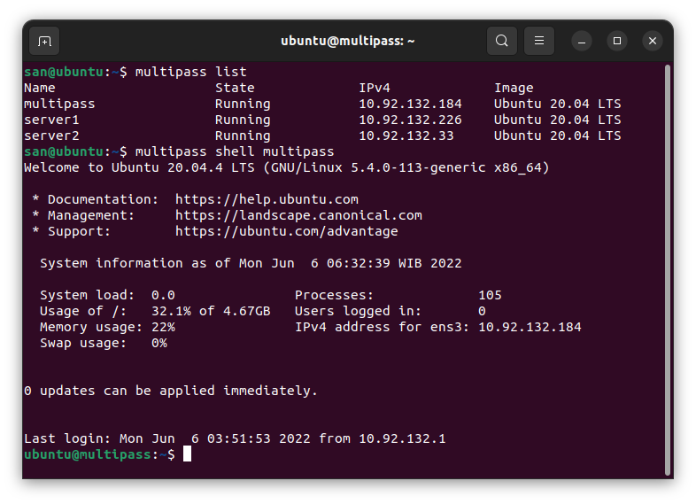

2. Kita update dulu, agar environment kita selalu ter up-to-date 

```
sudo apt update; sudo apt upgrade
```


3. Kemudian kita install Nginx

```
sudo apt install nginx
```

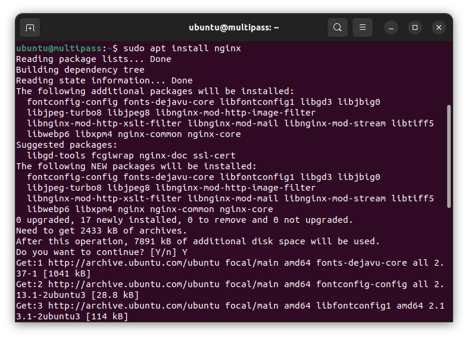

4.Untuk cek status nginx gunakan perintah

```
sudo systemctl status nginx
```
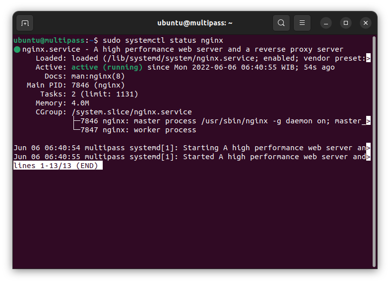

5. Mengecek versi nginx menggunakan

```
nginx -v
```

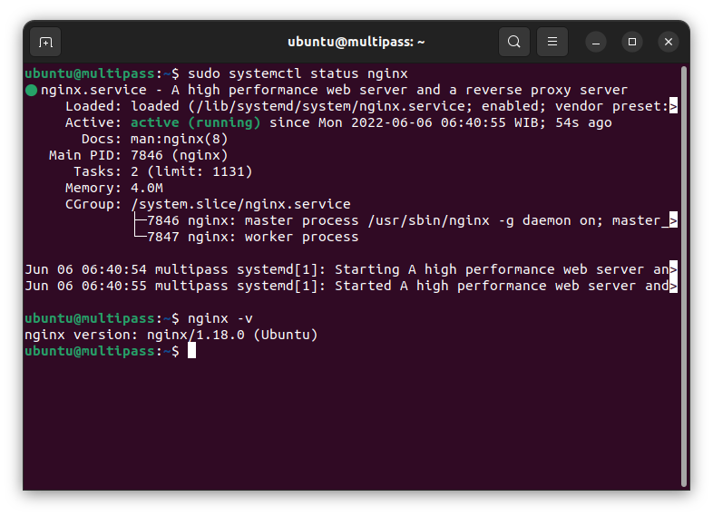

6. kemudian saya akan cek pada web browser

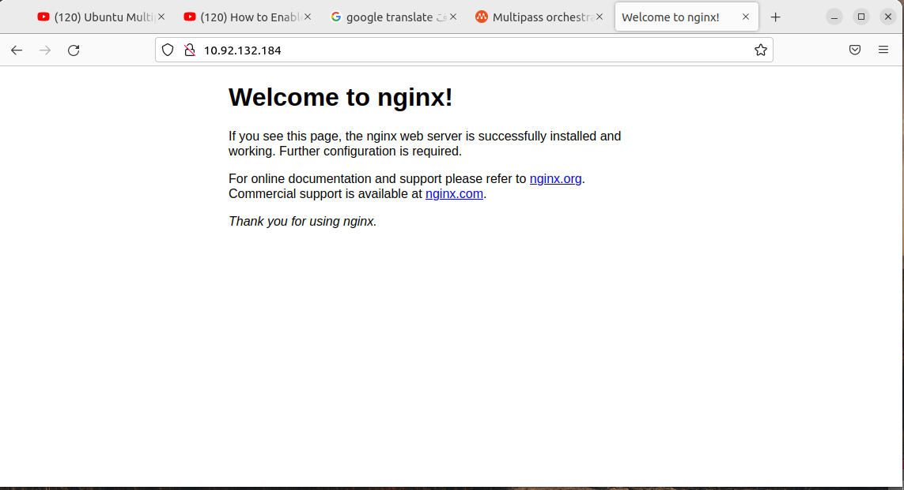

Ket : Jika muncul seperti gambar diatas artinya web server nginx sudah berhasil diinstall dan sudah berjalan


# Step 3 - Membuat Konfigurasi Reverse Proxy pada server

## Apa itu Reverse Proxy?

Reverse proxy merupakan konfigurasi standar yang digunakan untuk mengubah jalur traffic, misalkan aplikasi menggunakan port 3000 tetapi agar dapat di akses melalui port 80 maka harus menggunakan reverse proxy.

Berikut adalah konfigurasi dari revese proxy :

```
server { 
    server_name domain.com; 
    
    location / { 
             proxy_pass http://127.0.0.1:3000;
    }
}
```

## Membuat Konfigurasi Reverse Proxy 


1. langkah pertama masuk ke folder nginx setelah lalu buat suatu directory baru telebih dahulu.

```
cd /etc/nginx
```

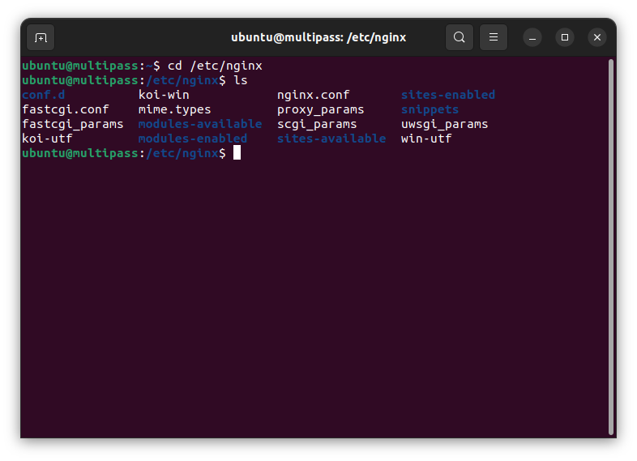

```
sudo mkdir wayshub
```


2.Setelah itu masuk ke directory yang sudah kalian buat, setelah itu buat suatu file dengan nama `frontend.conf`

```
cd wayshub
```

```
sudo nano featureapps.conf
```

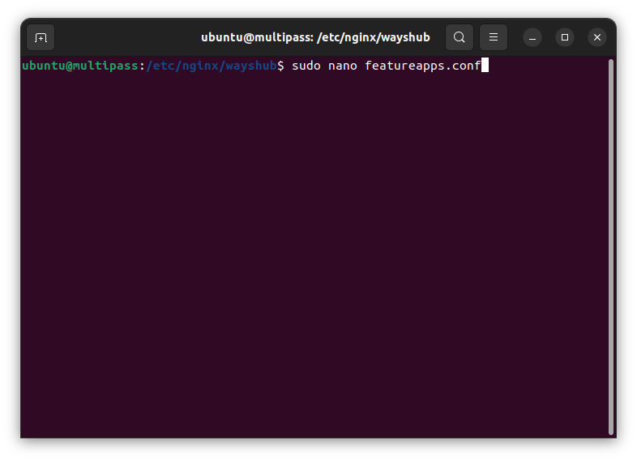

3. Setelah itu masukkan konfigurasi berikut:

```
server { 
    server_name devops.xyz; 
  
    location / { 
             proxy_pass http://127.0.0.1:3000;
    }
}
```

dan kalian jangan lupa menamakan domainnya dengan `devops.xyz` okeeyy

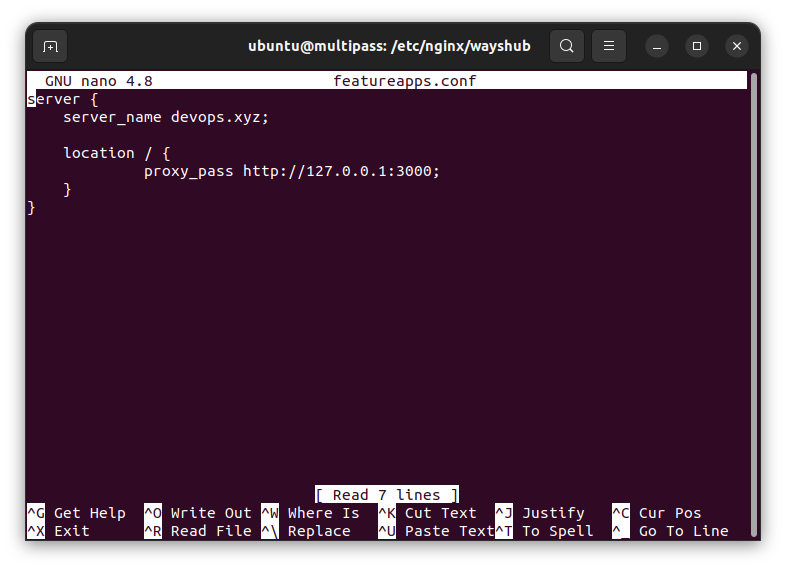


4. kita pindah dulu ke server1 dan  kita clone apilkasinya dengan perintah  :

```
git clone https://github.com/dumbwaysdev/wayshub-frontend
```

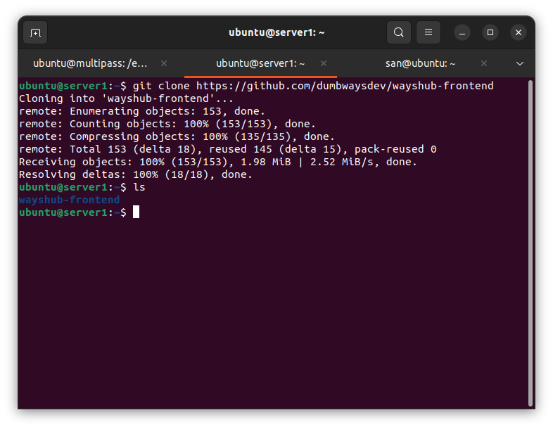

5.lalu Kita masuk ke folder aplikasinya dan ketik `ip a` untuk meng-copy ip nya

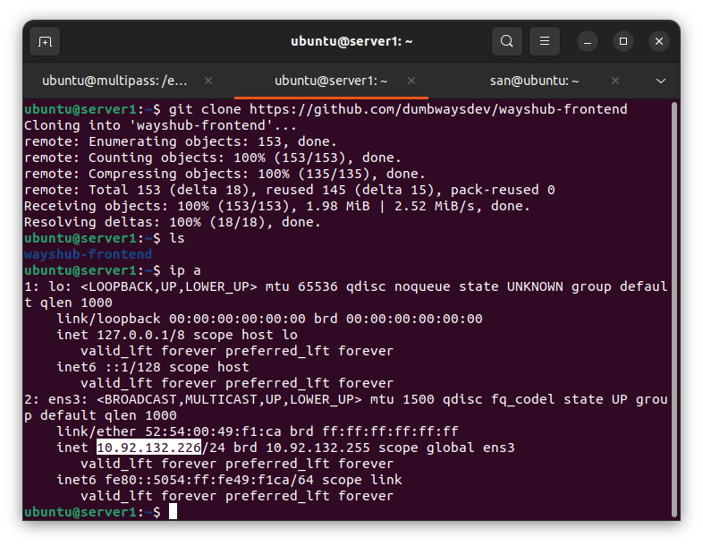

6.Setelah itu kita masuk lagi multipass, lalu ke file `featureapps.conf` dan paste ip aplikasinya 

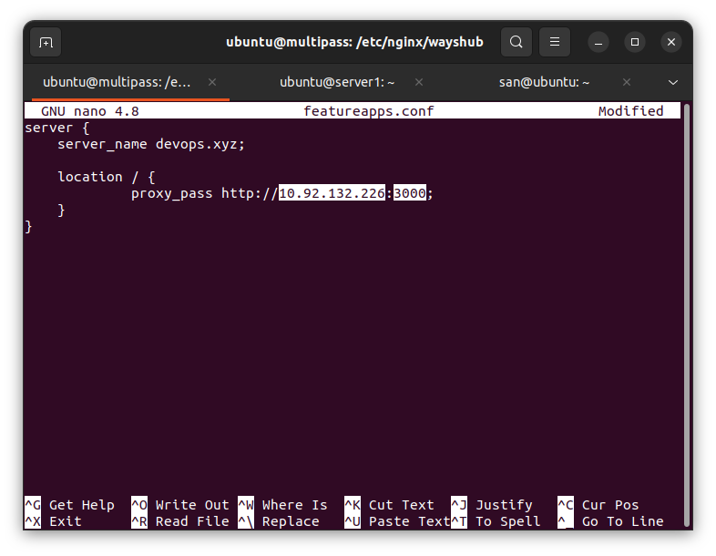

7. Selanjutnya keluar dari directory `wayshub`, setelah itu masuk ke dalam file `nginx.conf`.

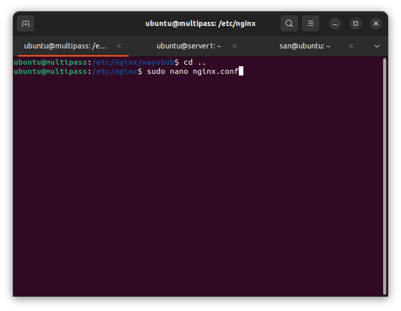

```
sudo nano nginx.conf
```

8. pergi ke-bagian include, setelah itu masukan lokasi dari directory yang bersi konfigutasi yang sudah kalian buat tadi.

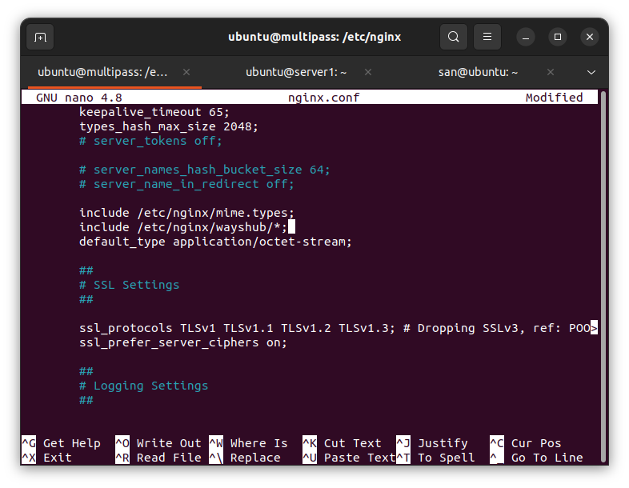


9. Beberapa proses tadi adalah cara untuk membuat reverse proxy untuk aplikasi kita, kemudian pastikan untuk melakukan pengecekan konfigurasi menjalankan perintah berikut :

```
sudo nginx -t
```


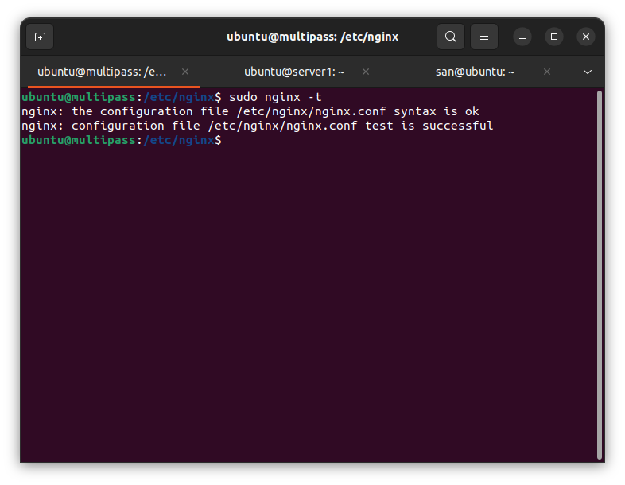

nah disini dikatakan kalau syntax kita telah berhasil


10. Jika sudah sekarang kita tinggal melakukan restart/reload Nginx kita.

```
sudo systemctl restart nginx
```

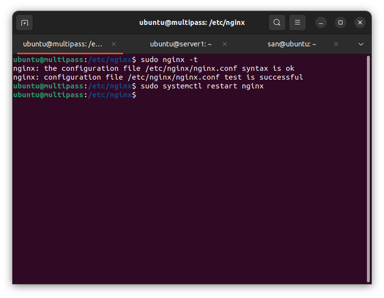

11. kita akan melakukan cek status 


12. Sekarang kita akan membuat sebuah virtual host. Untuk membuat virtual host kita harus masuk ke local server kita setelah itu masuk ke dalam file `/etc/hosts`.

```
sudo nano /etc/hosts
```


Setelah itu masukkan IP server kita, masukkan nama domain yang kalian.


selanjutnya masukan ip nya di lokal server dan masukan nama yang diinginkan

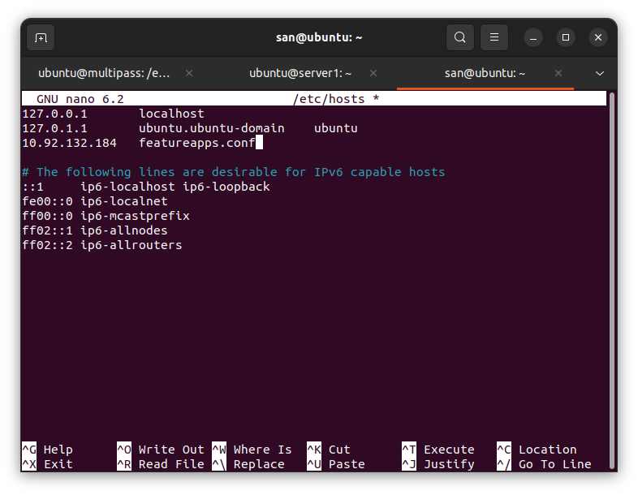


13. Jika sudah sekarang coba buka web browser kalian setelah itu coba akses nama domain kalian.

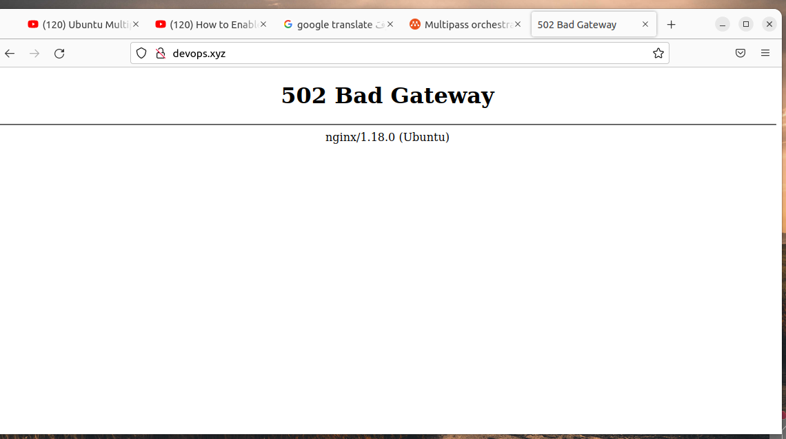


14. Nah disini kita mendapatkan 502 Bad Gateway kenapa? karena kita belum menjalankan aplikasi kita. Sekarang kita coba untuk menjalankan aplikasi wayshub yang sudah pernah kita pakai sebelumnya.

15. Masuk ke server1 yang sudah kita clone aplikasi wayshub tadi

kemudian masuk ke file nya

kemudian install npm nya 

```
sudo apt install npm
```

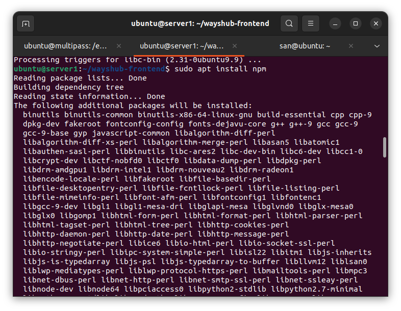

keterangan : perintah di atas ini bertujuan untuk meng-install module dari aplikasi `node.js`

kita boleh cek dulu versi npm dan node nya `npm -v` dan `node -v`

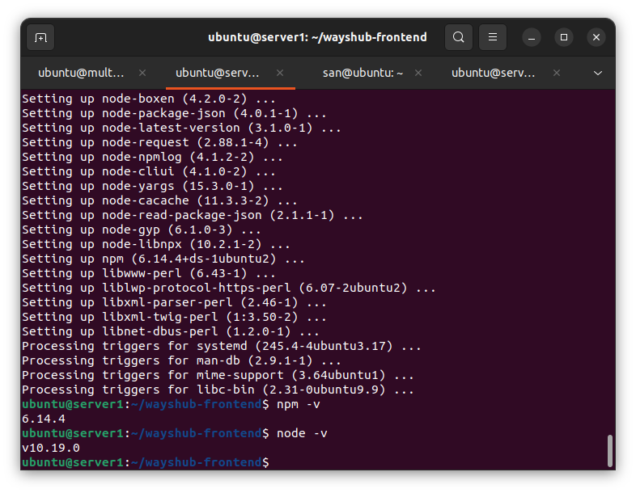


16. kemudian kita mencoba untuk install npm dengan perintah `npm i`


dari gambar diatas sudah terlihat bahwa package node_modules nya sudah ada 

Kemudian Kita jalankan lagi dengan perintah `npm start`


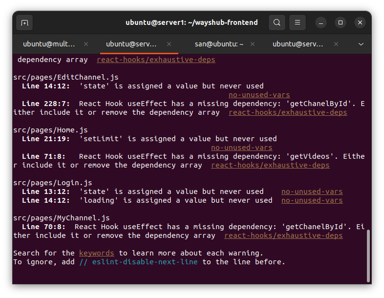


17.Kemudian Mari kita cek browser

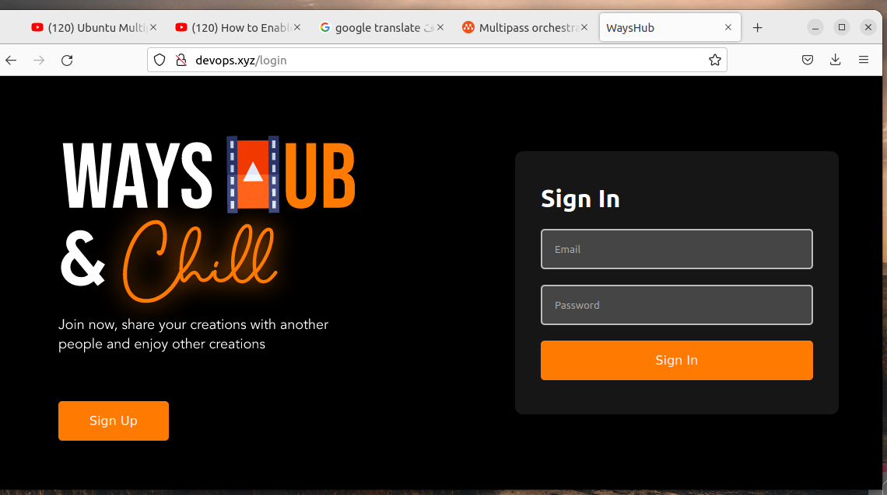

dan Reverse Proxy berhasil dijalankan


# Terimakasih :)


