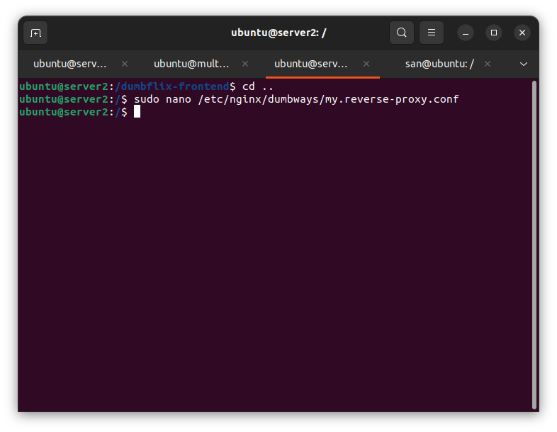
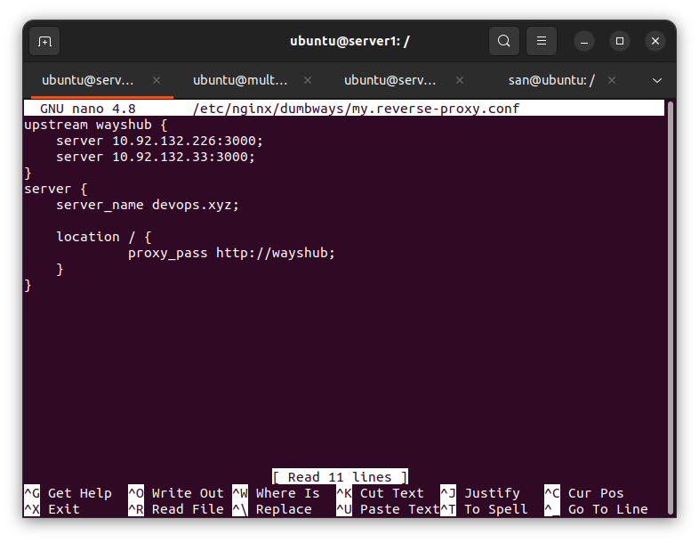
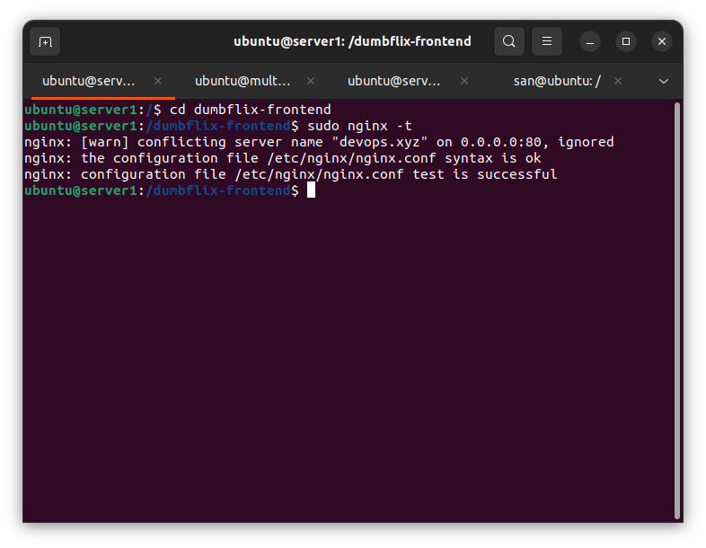
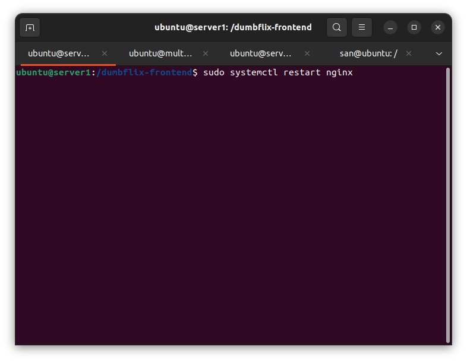
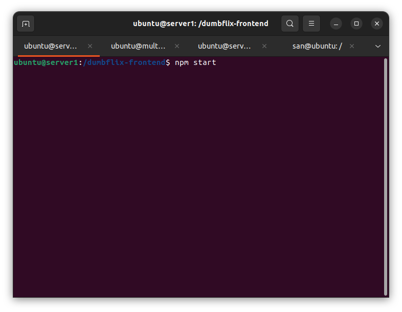
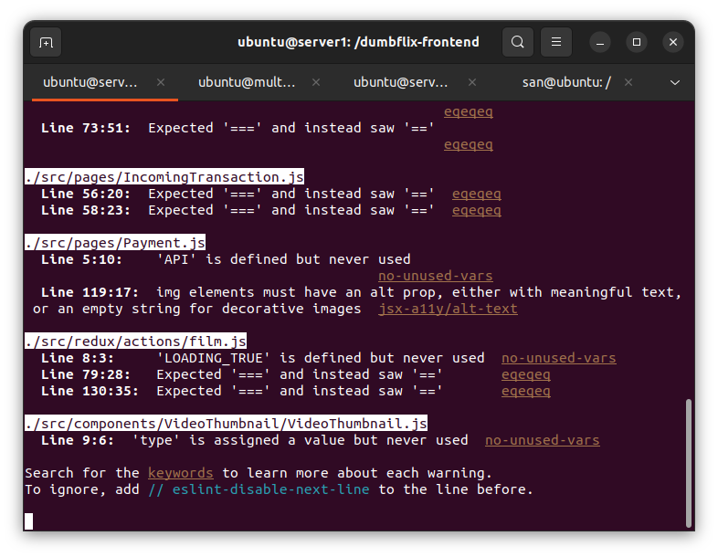
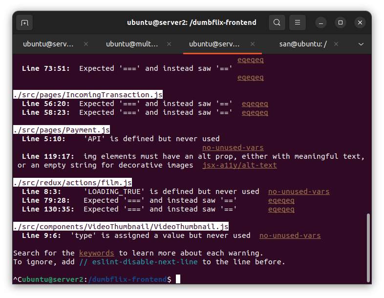

# Langkah 1
## Load and Balancing

1. Pertama-tama kita masuk ke dalam konfigurasi reverse proxy yang sudah kita buat sebelumnya.

sudo nano /etc/nginx/dumbways/my.reverse-proxy.conf

2. Selanjutnya kita akan tambahkan konfigurasi ke dalam file my.reverse-proxy.conf. Sekarang kita akan coba tambahkan beberapa konfigurasi, kalian dapat menggunakan konfigurasi di bawah ini.

3. nah pada bagian seperti diatas kalian masukan ip aplikasi kalian semuanya yang mau di load balancingkan
lalu pada bagian domain kalian masukan sesuka kalian ingin menjadi doamin apa asal ber extensin .XYZ

4. Jika sudah sekarang kita coba cek apakah konfigurasi yang sudah kita buat tadi itu error atau tidak. dengan mengetik

sudo nginx -t

5. Jika tidak ada error jalankan perintah restart nginx untuk merestart nginx kita, karena kita sudah menambahkan suatu konfigurasi baru di dalam file reverse proxy kita.

sudo systemctl restart nginx

6. lalu jalankan aplikasi kita 

npm start

7. nah sekarang coba kalian maarikan sala 1 server kalian untuk memastikan bahwa load and balancingnya sudah sukses berjalan

-- mematikan server 1

hasilnya

-- mengihidupkan server 1 dan mematikan server 2

hasilnya

