# Task 1 Day 1

# Step 1

## Download Ubuntu Server dan VMware terlebih dahulu

1. Link untuk mendownload https://ubuntu.com/download/server lalu klik "option 2 - Manual server installation"

2. Download VMware terlebih dahulu https://www.vmware.com/products/workstation-player/workstation-player-evaluation.html seperti gambar dibawah ini

Kiri untuk Windows dan kanan untuk Linux

# Step 2

## Instalation and Configuration VMware

1. Setelah download aplikasi maka langsung di install lalu jalankan VMware klik "Create a New Virtual Machine" 

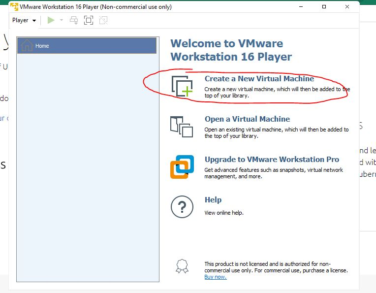

2. Kemudian pilih "Installer disc image (iso)" agar memasukkan file iso Ubuntu server lalu browse dan pilih file Ubuntu Server yang telah di download sebelumnya

3. Selanjutnya Input nama kita dan password nya.

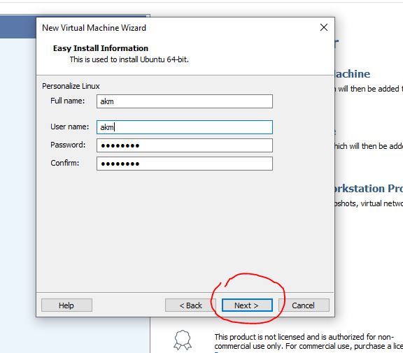

4. Input size storage yang akan kita gunakan, disini saya memasukkan 15GB, kemudian klik next

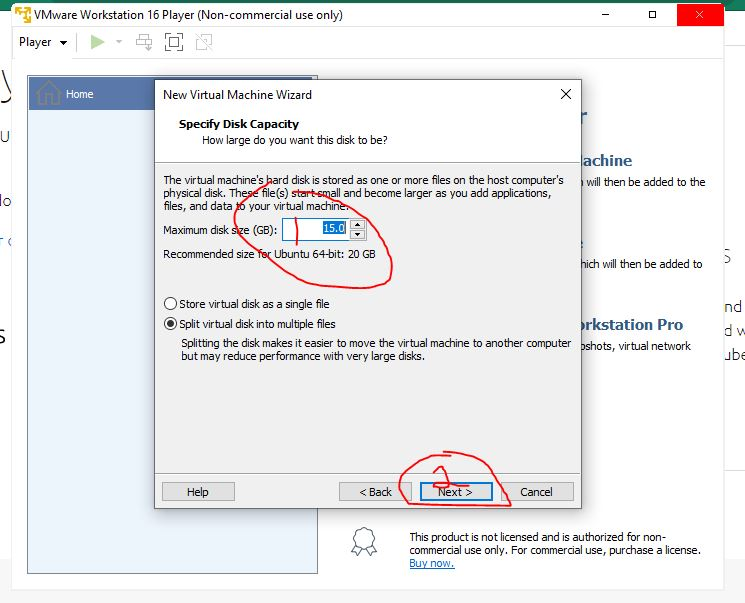

5. Pilih "Customize Hardware" untuk mengkonfigurasi Virtual Machine Ubuntu Server

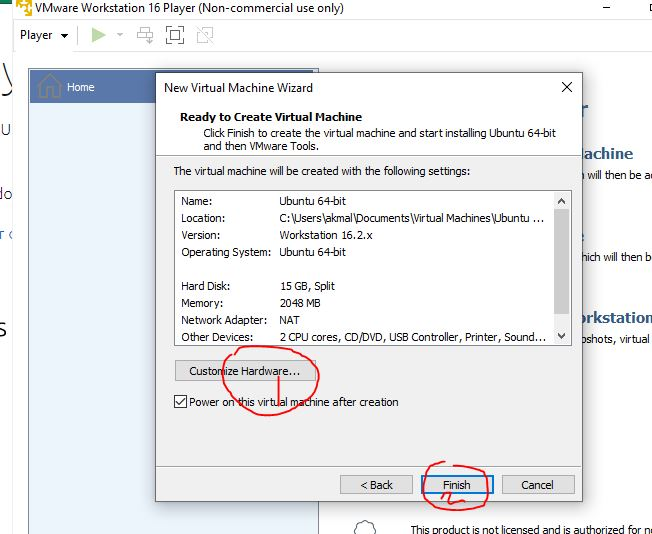

6. Kemudian masukkan 2GB untuk memory, Processor 2 Core, pada bagian Network Adapter pilih "NAT" lalu close

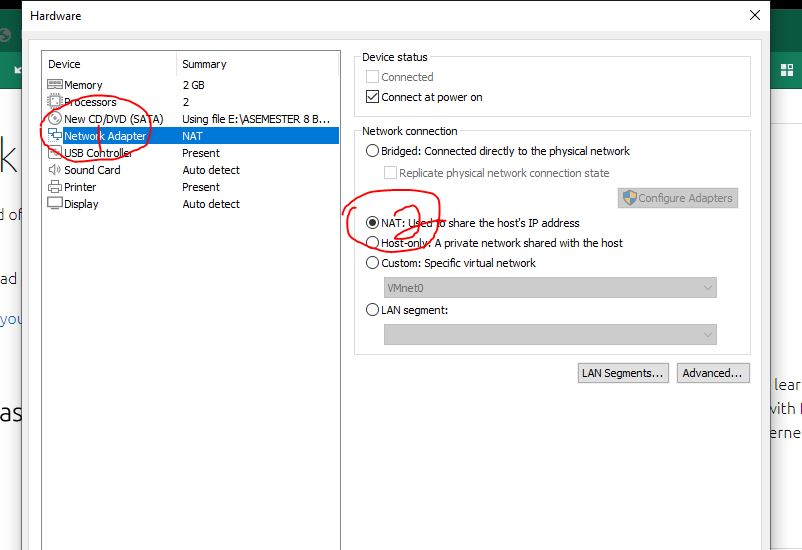

7. Kemudian Finish jika konfigurasi sudah selesai ditentukan

8. Kita jalankan server yang telah kita buat dengan menekan salah satu dari 2 tombol berikut

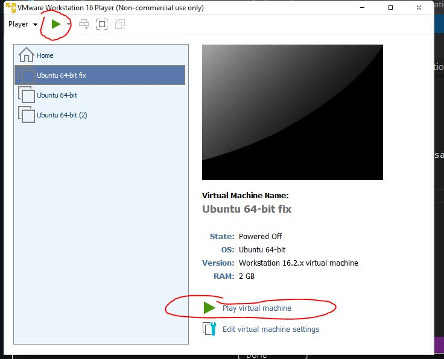

9. Pilih Bahasa Inggris lalu tekan tombol Space pada keyboard

10. Setelah itu Done

11. Selanjutnya konfigurasi jaringan menjadi Statis dengan klik bagian ens33 eth

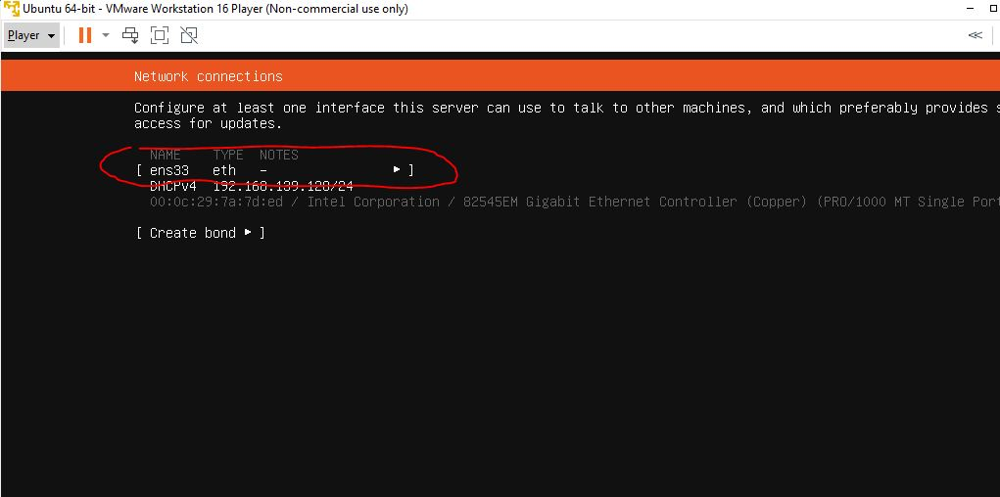

12. Kemudian pilih "Edit IPv4"

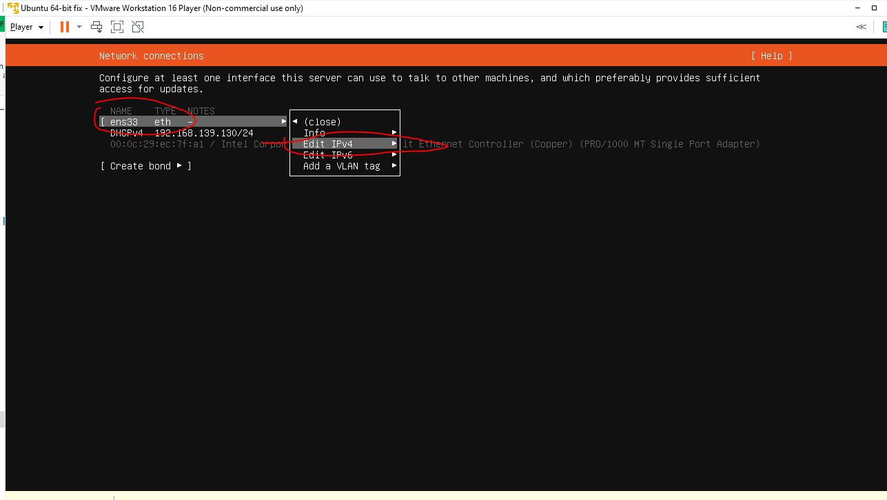

13. Mmasukkan ip statis sesuai device kita dengan cara jika di windows maka ketik ipconfig di cmd

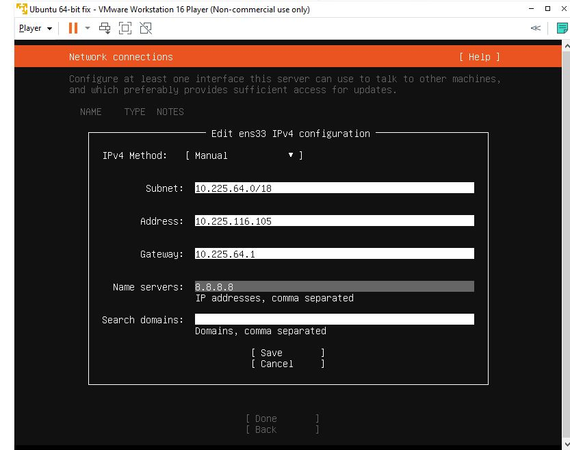

14. Apabila telah selesai selanjutnya pilih done

15. Kemudian pilih done di tampilan ini

16. Pilih Done lagi

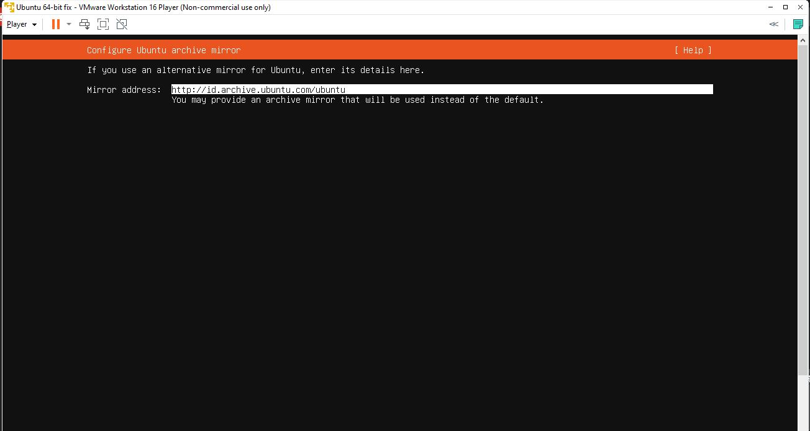

17. Klik "Custom Storage Layout"

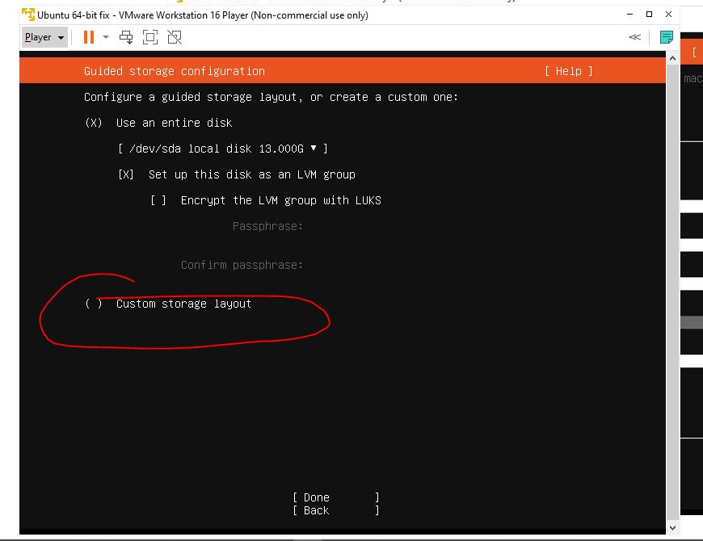

18. Pilih "Free Space -> Add GPT Partition" lalu masukan size maksimal dan selanjutnya Create

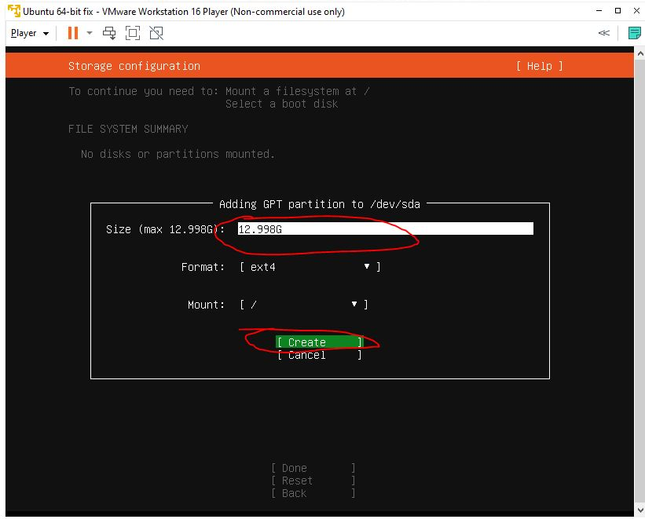

19. Jika sudah selesai pilih Done

20.  Disini kita masukkan nama dan password yang nantinya ingin digunakan untuk login di Ubuntu Server, jika udah selesai kemudian pilih done

21. Pilih "Install OpenSSH Server" lalu klik Done

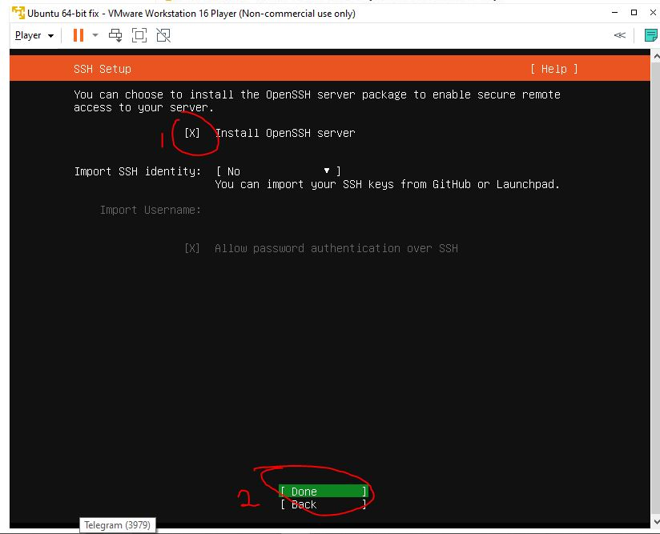

22. Nah disini kita klik Done dan munggu hingga proses instalasi selesai

23.  Jika sudah selesai Tinggal kita Reboot

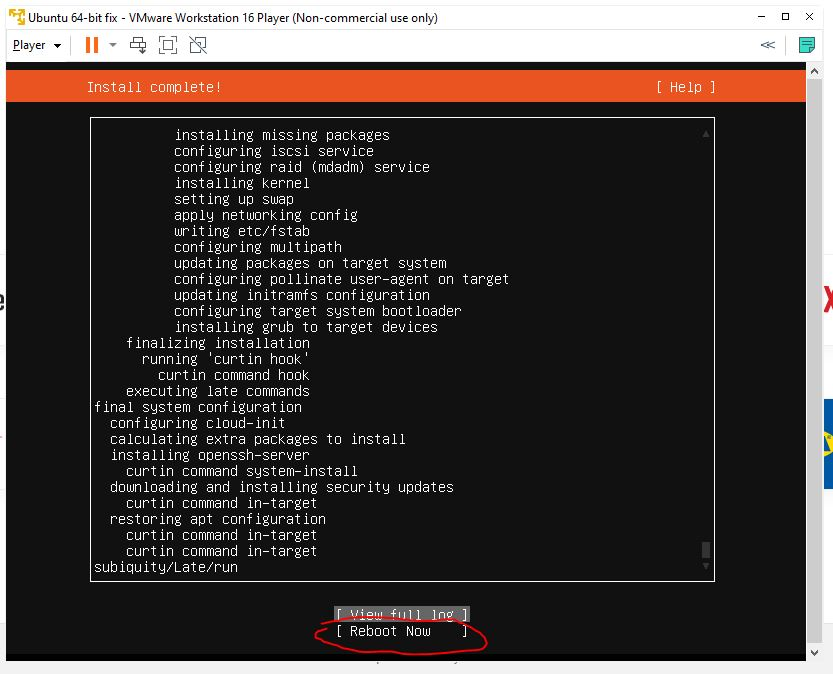

24. BRAVO.. !!! Instalasi Dan Konfigurasi di VMware sudah selesai

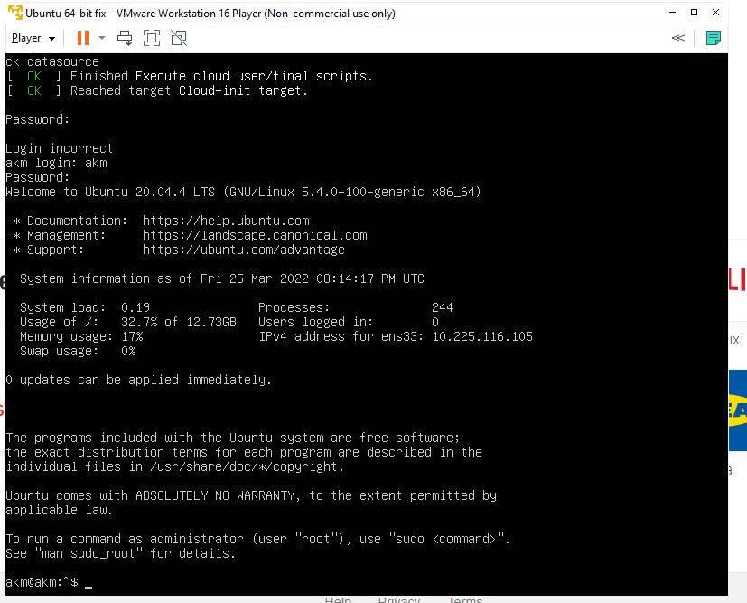

